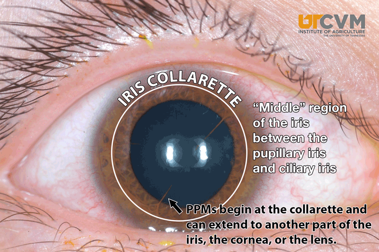
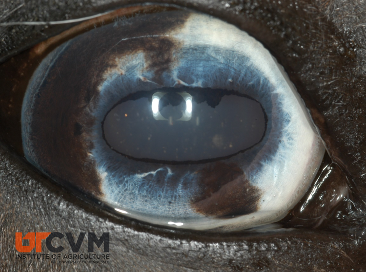
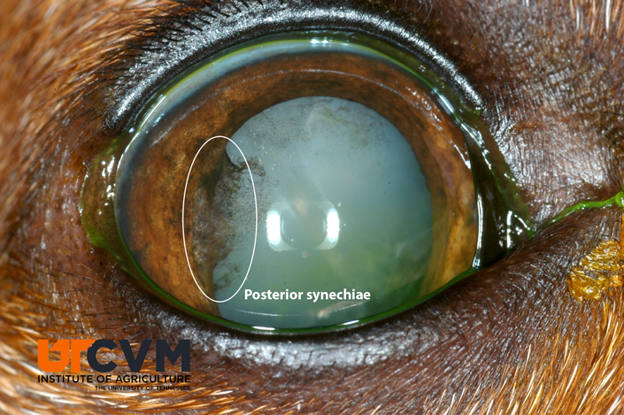
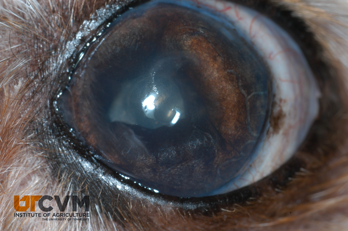

Anterior Uveal Anatomy and Physiology
=====================================

-   Anterior uvea is comprised of the iris and ciliary body which are
    extremely vascular

-   Iris contains the sphincter muscle, dilator muscle, and stroma

-   Ciliary body is made of the ciliary body muscle for accommodation
    and a pigmented and nonpigmented epithelium. The nonpigmented
    epithelium is thought to be responsible for creating aqueous humor.

-   Pupillary size and response to light (pupillary light reflex, PLR)
    are important to observe. A direct PLR describes how that pupil
    behaves when you shine a light into that eye. A consensual PLR
    describes how the pupil behaves when you shine a light into the
    opposite eye. PLRs should be brisk and complete.

    In a normal eye, pupil size is a balance between the tonic activity
    of the parasympathetic nervous system activating the pupillary
    sphincter muscle, and the tonic activity of the sympathetic nervous
    system activating the pupillary dilator muscle. Also in a normal
    eye, light falling on the retina activates photoreceptors, which
    then activate a reflex pathway involving midbrain structures that
    loop back through the parasympathetic pathway to cause the pupil to
    constrict.

Congenital abnormalities
========================

Persistent pupillary membranes
------------------------------

Definition  
Strand(s) of tissue that extend from the iris collarette to the lens,
cornea, or another area on the iris

Occurrence  
Any species - most commonly the dog. Inherited in Basenjis and Corgies

Treatment  
None needed

Heterochromia iridis
--------------------

Definition  
Multicolored iris. Usually seen in animals with dilute coat colors.
These animals often lack fundic pigment, may lack tapetum.

Treatment  
None, do not confuse with a melanoma

Anterior Uveitis
================

Definition  
Breakdown of the blood ocular barrier (via inflammation or another
process).

Clinical Signs
--------------

1.  Aqueous flare/hypopyon/keratic precipitates/fibrin clots - leaking
    of cells and protein from uveal vessels. In order to maintain its
    optical clarity, aqueous humor is normally a relatively low-protein
    fluid. The higher the protein content of a water-based fluid the
    murkier the fluid. Normally there is an intact blood aqueous barrier
    in the iris and ciliary body (much like the blood brain barrier)
    that keeps protein out of the aqueous humor. When these tissues are
    inflamed, they don’t perform these functions properly and proteins
    and sometimes cells are allowed to enter the aqueous, resulting in a
    turbid aqueous humor.

    When one shines a FOCUSED LIGHT SOURCE (such as the circle in a
    direct ophthalmoscope) into the eye from the front and observes from
    the side, the beam of light traversing the anterior chamber will be
    visible if it contains appreciable quantities of protein. This
    phenomenon is called aqueous flare, and for all practical purposes
    is pathognomonic for anterior uveitis. Flare is subjectively graded
    on a 1 – 4 scale (1=you can barely see it; 4=it’s so dense it
    obstructs your visualization of the iris).

<!-- -->

1.  Miosis - due to prostaglandin released from the inflamed tissues
    acting on the sphincter muscle causing it to constrict. Frequently
    with mild uveitis miosis will not be apparent until resistance to
    mydriatics is seen. In addition to having acetylcholine receptors
    for parasympathetic neurotransmission, the pupillary sphincter is
    loaded with PG receptors, and activation of these receptors results
    in intense miosis.

2.  Pain - blepharospasm, photophobia, enophthalmos, prolapse of the
    third eyelid, lethargy. Pain is caused by ciliary spasm.

3.  Redness - ciliary flush, episcleral congestion. Episcleral injection
    usually indicates intraocular disease, usually either anterior
    uveitis or glaucoma; scleritis will also cause episcleral injection,
    but this is a relatively rare disorder. It is very common for
    episcleral injection to cause conjunctival injection from contiguous
    inflammation, but the opposite is not true. Thus, dogs with anterior
    uveitis or glaucoma frequently have episcleral and conjunctival
    injection, but dogs with conjunctivitis associated with KCS will not
    have episcleral injection.

4.  Corneal edema - from inflammatory cells damaging endothelium.

5.  Decreased intraocular pressure - due to decreased aqueous production
    from the ciliary body. Inflammation decreases the ability of the
    ciliary body to produce aqueous and there is also increased
    non-conventional outflow from dilated leaky vessels.

6.  Synechia - iris sticking to lens (posterior) or iris sticking to
    cornea (anterior). Iris adheres with uveitis because fibrin is
    sticky. 

7.  Secondary glaucoma occurs because of iris bombé, or cells in angle.
    Bombe is the phenomenon in which the pupil becomes synechiaed
    posteriorly to the lens for 360o, such that aqueous humor cannot
    flow through the pupil. As a result, aqueous builds up behind the
    iris, causing it to bow forward. When this happens the peripheral
    iris synechiaes anteriorly to the cornea, thus obliterating the
    iridocorneal angle 

8.  Cataract formation - abnormal metabolism in the lens due to abnormal
    aqueous.

9.  Iridial changes - The iris may become darker, congested, and/or
    swollen. Rubeosis iridis may develop with chronicity.

General Treatment for Anterior Uveitis
--------------------------------------

### Goals of treatment

1.  Decrease pain - must stop ciliary spasm

2.  Prevent synechia - must dilate pupil or at least keep it moving

3.  Decrease cellular and protein exudation to prevent glaucoma - use
    anti-inflammatory drugs.

### Parasympatholytic drugs (see Cornea notes)

1.  Atropine

2.  Tropicamide

### Corticosteroids

MOA  
-   Immunosuppressive

-   Inhibit arachidonic acid metabolism

-   Anti-fibrotic

-   Inhibit neovascularization

General Indications  
-   Inflammatory diseases such as uveitis

-   Immune mediated diseases

-   Reduction of neovascularization/scarring in corneal disease

Contraindications  
-   Corneal ulceration

-   Active infection - if the animal has a systemic disease such as
    blastomycosis with secondary uveitis, topical steroids can be used,
    but systemic steroids should be avoided.

Side Effects  
-   Retard corneal epithelialization

-   Activate latent collagenase

-   May encourage infection

-   Topical steroids can have systemic side effects

Best topical preparations for intraocular inflammation are 1%
prednisolone acetate and 0.1% dexamethasone. Dosage frequency may
initially be q4 hours then decreased to QID. Systemic prednisone is also
useful in the treatment of uveitis when the systemic use is not
contraindicated.

### Nonsteroidal anti-inflammatory agents:

MOA  
Cyclooxygenase inhibition

Indications  
-   Inflammatory disorders when corticosteroids are contraindicated

-   Adjunct to corticosteroid therapy (especially uveitis)

Topical Preparations  
-   Flurbiprofen

-   Suprofen

-   Diclofenac

Generally these drugs are prescribed to be used 3-4 times daily.

Contraindications  
-   Topical nonsteroidals seem to inhibit healing of corneal ulcers. I
    don’t look at this as an absolute contraindication for using them on
    ulcerated corneas, but only use them when necessary.

### Differential etiologies for anterior uveitis

1.  Infection

    -   Blastomycosis, histoplasmosis, other fungal diseases,
        prototheca, pyometra, Brucella, septicemia, tooth root
        abscesses, prostatic abscesses, heartworm disease, Rickettsia,
        RMSF, toxoplasmosis, ICH.

        Diagnostics  
        -   Appropriate test for locale and other clinical and physical
            findings.

        Treatment  
        -   Treat uveitis with general therapy, and treat primary
            disease.

        -   Do not put a dog on systemic steroids if you suspect a
            systemic infectious disease.

2.  Lens-induced uveitis

    -   This is a local immune-mediated cause of anterior uveitis that
        occurs when cataracts develop to the phase of “hypermaturity,”
        in which lens proteins liquefy and begin to leak out of the lens
        capsule. The lens is an immune-privileged site; throughout life,
        small amounts of lens protein leak out of overwhelming,
        tolerance is lost, and anterior uveitis ensues.

        Diagnostics  
        -   A cataract must be present for lens induced uveitis to
            occur.

        Treatment  
        -   General uveitis therapy. Must get the uveitis under control
            to do cataract surgery. If the cataract is from acute trauma
            with puncture to the capsule, must remove lens to save eye.

3.  Secondary uveitis

    -   Spread of inflammation from the sclera or cornea - most commonly
        this occurs secondary to ulcerative keratitis.

4.  Neoplasia

    -   Lymphosarcoma, melanoma, ciliary body adenoma, multiple myeloma,
        etc.

        Diagnostics  
        -   Complete physical exam, chest radiographs, and ocular exam.

        Treatment  
        -   If the neoplasm is localized to the eye - enucleate. If
            systemic - treat accordingly.

5.  Trauma Blunt and penetrating trauma can also cause anterior uveitis.
    Blunt trauma to the eyeball causes inflammation inside the eye by a
    complex “acoustic interface” mechanism, and penetrating trauma often
    results in direct damage to anterior uveal structures.

    Diagnostics  
    -   History, physical exam, fluorescein stain.

    Treatment  
    -   General therapy if no corneal ulcer is present. If an ulcer is
        present treat appropriately with topical antibiotics. If uveitis
        is severe one can treat the dog with low dose of systemic
        prednisone or can try a topical nonsteroidal.

6.  Uveodermatologic syndrome

    -   Autoimmune disease against melanocytes.

        Diagnostics  
        -   Depigmentation of skin, nose, uveitis, and chorioretinitis.
            Most commonly occurs in Akitas, chows, Huskies, and Samoyeds

        Treatment  
        -   Immunosuppressive doses of steroids, usually need
            azathioprine or mycophenolate systemically. Treat eyes with
            general uveitis therapy. Frequently develop secondary
            glaucoma or retinal detachments.

        Prognosis for vision  
        -   Guarded to poor. Many dogs become blind even with aggressive
            treatment.

7.  Cardiovascular::

    -   Systemic hypertension (i.e., high blood pressure)

        Diagnostics  
        -   Blood pressure measurement with blood work and urinalysis.

        Treatment  
        -   Generally treated with enalapril or amlodipine.

8.  Idiopathic (most likely immune-mediated)::

    -   In the cat idiopathic uveitis is very common, it the dog,
        however, a cause is more frequently found if diagnostics are
        pursued.

Summary
-------

All uveitis cases need a complete history and PE, many cases need
complete blood work, titers, chest films and lymph node aspirates if
indicated. Treat eyes locally and use systemic therapy where indicated.

Hyphema
=======

Blood in the anterior chamber (clotted or free)

Complications (same as anterior uveitis)

-   Synechia

-   Cataract

-   Secondary glaucoma

-   Retinal detachment

-   Phthisis bulbi

Etiologies

-   Trauma - blunt or penetrating, post-operatively

-   Intraocular neoplasia

-   Blood dyscrasias - leukemias, polycythemia

-   Clotting abnormalities - Von Willebrands, dicoumarin, liver dz.,
    DIC, warfarin, IMT

-   Circulatory disorders - hypertension, hyperviscosity

-   Infectious diseases - RMSF, ehrlichiosis

-   Retinal detachments

-   Any disease that can cause uveitis

With so many varying differentials the history and physical are probably
the two most important diagnostics. From those one can determine whether
to pursue CBC, Panel (which are usually indicated unless the cause is
very obvious), chest rads, coagulation panel, titers.

One of the most valuable tools is ocular ultrasound - it can show
masses, retinal detachments and lens luxations. It probably diagnoses
75-85% of our cases of hyphema.

Treatment  
-   Treat the primary disease if one is present. Also treat the eye for
    anterior uveitis. Fresh blood does not tend to cause glaucoma as the
    cells are malleable, but as the cells age they lose the
    malleability. So watch for glaucoma.

Prognosis  
-   If the hemorrhage is localized to the anterior chamber generally the
    prognosis is pretty good. However, if hemorrhage is present in the
    vitreous secondary retinal detachment occurs commonly (or the
    detachment may have led to the hemorrhage which carries a poor
    prognosis).

Iris atrophy
============

This is a senile, degenerative change in which the iris musculature
(sphincter and/or dilator) atrophies, resulting in the holes seen in the
iris or an irregular pupillary margin. Because of sphincter atrophy, the
pupil may not constrict normally leading to poor PLRs. Iris atrophy is
completely benign, and causes no observable functional visual deficits.
This is extremely common in older dogs, and is probably the most common
cause of poor PLRs in dogs.

Therapy  
-   None - sunglasses?

Iris Masses
===========

Differential etiologies
-----------------------

1.  Iris cysts

    -   Cysts that originate from iris or ciliary body epithelium. The 2
        most caudal layers on the iris are the iris myoepithelial layer
        and the posterior pigmented epithelium. Embryologically the
        separation between these layers is a potential space, and cyst
        formation in this space is extremely common. Some believe that
        these cysts actually form in utero, but just do not become
        clinically evident until later in life as they grow. Because the
        cysts originate on the posterior surface of the iris, they are
        usually not visible until they become large enough that they
        break free and float into the anterior chamber. They are benign.

    -   Appearance - These are spherical and appear hollow when
        transilluminated and can be free- floating, attached to
        pupillary margin or settled out in the iridocorneal angle. Cysts
        can adhere to corneal endothelium and rupture leaving a dark
        circle of pigment.

        Treatment  
        -   None necessary. May be aspirated if interfering with vision.

2.  Iris Nevis

    -   Darkly pigmented focal lesion on iris face.

        Treatment  
        -   None necessary. Must monitor these as some may be
            preneoplastic.

3.  Uveal tumors

    -   Iris melanomas can be darkly pigmented or amelanotic. Ciliary
        body adenomas or carcinomas may also occur and are typically
        pink vascularized masses. Iris melanomas are very rare to
        metastasize in the dog. Ciliary body adenocarcinomas are more
        likely to metastasize. Keep in mind that secondary tumors may
        occur in the eye. Tumors cannot be transilluminated, are not
        free-floating and are not spherical. Uveitis may occur with a
        tumor secondary to leaky blood vessels.

        Treatment  
        -   If the tumor is a melanoma, it may be okay to watch it
            unless it starts to grow rapidly. Some tumors may respond to
            laser therapy. Usually enucleation is warranted.
