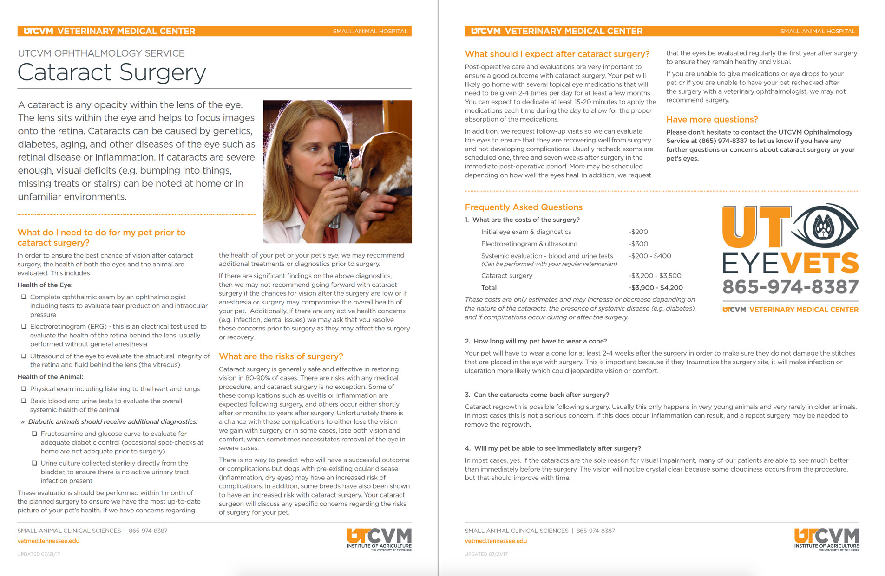

# Client Handouts

## Cataract surgery handout
- [Click here for the handout](https://www.dropbox.com/s/z4wal0uxdkjussh/cataract-surgery.pdf?dl=0) 

-   Goes over pre-op diagnostics, tests, FAQ
-   Current quote for surgery (including pre-op stuff): $3900-4200

## Dosing Chart
-   [Fancy dosing chart](https://www.dropbox.com/s/9ugetnegjloggz1/ophtho-drug-dosing-handout.pdf?dl=0)
- Example of how to organize giving medications

## Brachycephalic Airway
-   [Brachycephalic Airway Syndrome](https://www.dropbox.com/s/f1txjn5tpmtuoua/brachycephalic-airway-syndrome.pdf?dl=0)
- Describes the syndrome and the surgery to correct it - good for snorking bulldogs