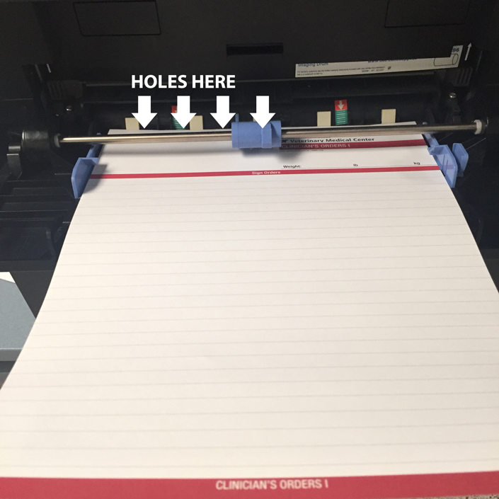
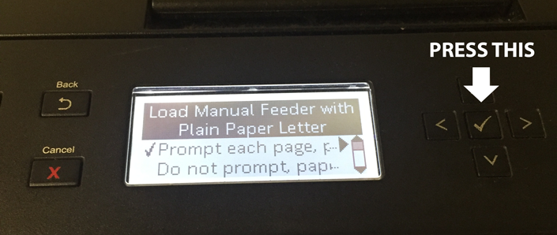

# Phaco Orders

## Surgery Checklist

- [Click here](https://www.dropbox.com/s/x3njoccz54dp8ia/Surgical%20Checklist%202018.docx?dl=0)

## Pre-op Wards Orders

- [Click here for Wards orders - NON-DIABETIC](https://www.dropbox.com/s/i82wwf7sg9nkl6x/Wards-Orders-non-diabetic.xlsx?dl=0)
- [Click here for Wards orders - DIABETIC](https://www.dropbox.com/s/82cltgkb0flyuei/Wards-Orders-diabetic.xlsx?dl=0)

## Post-op ICU Orders

- [Click here for
  the NON-DIABETIC orders](https://www.dropbox.com/s/eymmxmmwpa5tk9g/ICU-orders-for-postop-cataract-sx-non-diabetic.xlsx?dl=0)
- [Click here for
  the DIABETIC orders](https://www.dropbox.com/s/prnvnoerdfdcbea/ICU-orders-for-postop-cataract-sx-diabetic.xlsx?dl=0)

## How to Print Them

::: tip
Make sure you use Clinician’s Orders I (doesn’t have all the pre-printed fields)
:::

- Load the paper as shown below 

- Then press the check mark when prompted 
