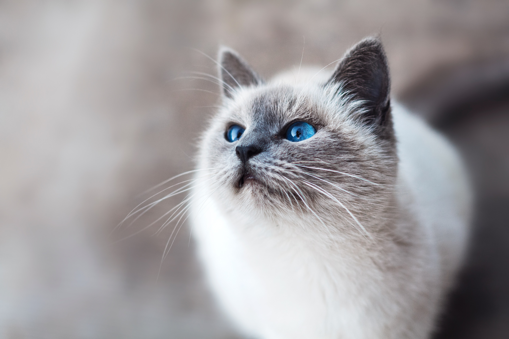

## Recent updates
03/2020
- Whoa, hello COVID-19! Now that you're here and I can't go to work and the economy is dying, it's time to focus on things that matter! Fonts! Changed the site-wide font, I think it looks prettier.
- More updates to follow I'm finding myself with all this free time.

03/2020
- Happy New Year!
- Still working on this thing (slow but sure)
- Added "Lab handouts" in Clinics per Dr. Cherry's request
- Added **a lot** more content to [Orbit](orbit/orbit.html) - it was originally in kind of an "outline" form and I want it to be more like "text" form. There's some outlines for treatment but a lot more explanatory material which I personally find more easier to read. I'd like to continue the same edits to the other parts here in the future (eyelids, cornea, etc.).
 - Included "footnotes" and "references" to [Orbit](orbit/orbit.html) - yay evidence-based medicine!
- New feature - "Details" where you can click on the arrow head for more information if you're curious (see example below):
::: detail Click me!
Hello! See here for "gee whiz" information or extra desired info that is not included in the main body or text.
:::
- New feature - "Hover for details" for pictures - another space-saving feature that will give more details for images as figures; if looking on a phone or something, the caption will just be expanded vertically (see example below):
<figure>
  
		<figcaption>
		<b>Cats are better than dogs (Hover your mouse over this image for details)</b>
		

    Because of the following important reasons:
			<ul>
			<li>They are quieter</li>	
			<li>They are cuter</li>	
			<li>They don't have to be taken outside to do their "business" :hankey: </li>	
			<li>Their eyes are prettier</li>	
			</ul> 
		

	</figcaption>
</figure>
- That's it! More content and changes to follow. If there are any suggestions, comments, or concerns, please feel free to reach out to me (tchendvm@gmail.com). Thanks for visiting!

11/2019

- Search works again! Hooray :tada:
- Made some minor stylistic changes
- Reorganized - put "clinical" links in group on the sidebar
- Reformatted & edited [Orbit](orbit/orbit.html), [Eyelids](eyelids/eyelids.html)

10/2019

- I'm back! After a few months hiatus working on some silly CE lectures, now I can devote some time to this little website. Did a couple background upgrades (nothing you'll really notice). Hope to restructure the website a little bit in terms of organization and then content.
- Broke "Search" functionality for a bit - trying to use a fancier thing but not working for now - stay tuned.

6/2019

- Reformatted & edited [Conjunctiva](conjunctiva/conjunctiva.html)

5/2019

- Reformatted & edited [Cornea](cornea/cornea.html)
- Added [Ophthalmic exam video](clinics/ophthalmicexam.html)

::: tip Questions or concerns? Something is broken?
Love ophthalmology and want to share a poem you wrote about it?

Please email Dr. Chen (tchendvm@gmail.com) with the details.
:::
