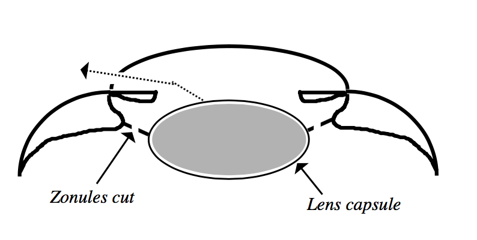

Lens diseases manifest as an abnormal appearance or an abnormal location
of the lens. Vitreous diseases manifest primarily as an abnormal
appearance.

Cataract
========

**Definition** : An opacity of the lens of the eye. If severe enough,
will prevent light from reaching the retina and therefore impair vision.

Classification based on “stage of development” (i.e., degree of lens
involvement)

1.  Incipient - Small focal opacity

2.  Immature - More diffuse, but fundic reflection still easy to see

3.  Mature - Fundic reflex barely visible or completely obliterated

4.  Hypermature - Lens material liquifies and leaks out of lens capsule
    into the interior of the eye. Major sign that cataract is
    hypermature is wrinkling of lens capsule. In addition, the lens
    material in hypermature cataracts often appears “glittery.” Fundic
    reflex may or may not be visible depending on how much lens material
    has leaked out. Usually associated with anterior uveitis of varying
    degree.

Cataracts usually (but not always!) progress from incipient through
mature or hypermature stages.

Etiologies
----------

1.  Genetic. Documented in numerous breeds

    1.  Documented in numerous breeds

    2.  Goldens and Huskies

        1.  Characteristic posterior subcapsular opacity

2.  Diabetes mellitus. Glucose levels in lens exceed capacity of
    glycolytic pathway, the excess is shunted toward production of that
    can’t escape the lens (sorbitol, fructose). Result is hyperosmotic
    lens that imbibes water, swells significantly (“intumescence”) and
    opacifies.

    1.  The first enzyme in that sorbitol pathway is aldose reductase.
        As such, it would make sense that if AR could be inhibited then
        progression down the sorbitol pathway would not be possible. An
        AR inhibiting eyedrop is indeed in development.

3.  Secondary to uveitis. Is seen in all species, and is the most common
    cause of cataracts in horses and cats.

4.  Nutritional cataract. Cataracts are relatively commonly seen in
    orphaned animals raised on milk replacer. Arginine is often blamed
    as the missing nutrient but there is little actual evidence. As the
    animal ages the “new” lens material is usually normal, so
    nutritional cataracts may cause minimal symptoms in the adult.

5.  Age related cataract. Cataracts due to age, which are the rule in
    humans, really aren’t that common in dogs. When they do occur they
    are often most prominent in the nucleus.

6.  Cataracts associated with Progressive Retinal Atrophy (PRA). PRA is
    a genetic retinal disease that causes irrevocable (and untreatable)
    blindness. We’ll study PRA in detail later in the term. A certain
    percentage of PRA dogs have concurrent cataracts for reasons that
    aren’t entirely clear. The importance of knowing this is that
    cataract removal won’t improve vision in these dogs.

**Description** based on what part of the lens is involved.

Cortical, nuclear, capsular

Equatorial, axial

Treatment
---------

-   Surgery is the only effective means of treating cataracts.

-   Not all dogs with cataracts need to be treated. For example, an
    animal with an incipient equatorial opacity will have excellent
    vision, and as long as the opacity doesn’t progress its vision will
    remain excellent.

Surgical techniques
-------------------

Intracapsular cataract extraction (ICCE) - Through a large corneal
incision and a pharmacologically dilated pupil, the ciliary zonules are
cut and the entire lens is removed. Not recommended for routine cataract
surgery; reserved primarily for removal of luxated lenses

Extracapsular cataract extraction (ECCE) - Through a large corneal
incision and pharmacologically dilated pupil a portion of the anterior
lens capsule is removed and the lens nucleus and cortex are manually
expressed through this “capsulotomy”. The equatorial and posterior
portions of the lens capsule are left in place.

Phacoemulsification - A variation of ECCE. Through a small corneal
incision, an anterior casulotomy is made and the nucleus is liquified
using ultrasound (NOT LASER!!). The liquified nucleus and the cortex are
then aspirated through the same small corneal incision (the cortex is
soft enough that it can be aspirated without being ultrasounded). During
the procedure the anterior chamber is irrigated so that the eye never
collapses. A small handpiece simultaneously performs the ultrasound,
irrigation, and aspiration.

Your text has an excellent section on the details of
phacoemulsification. While I encourage you to read this section, the
detail provided is geared towards the ophthalmologist so don’t get
bogged down in those details.

### Lens replacement

Prosthetic intraocular lenses (IOLS) are available for dogs. Without an
IOL light rays will fall to focus behind the retina instead of on the
retina — i.e., the dog will be hyperopic or “far-sighted”. The extent to
which an IOL improves vision and quality of life in dogs is a hotly
debated topic.

When to refer for surgery
-------------------------

-   Phacoemulsification is currently the preferred method of cataract
    extraction. Surgical time is shorter, postoperative inflammation is
    reduced, and overall success rate is higher. However, surgery must
    be done fairly early because as the animal ages and the cataract
    becomes more mature, the lens becomes denser. If too dense, the
    ultrasound will not successfully dignify the nucleus.

-   It is advantageous to operate prior to the onset of hypermaturity
    because the uveitis that accompanies hypermaturity drastically
    reduces the success rate.

Concurrent retinal disease
--------------------------

A fair percentage of dogs with cataracts also have a retinal disease
called progressive retinal atrophy (PRA). PRA is an untreatable,
blinding condition. Therefore doing cataract surgery in an animal with
PRA will not improve vision. PRA can be diagnosed on retinal exam, but
if a cataract is present it may be impossible to adequately visualize
the retina. Fortunately we can assess retinal function even in the
presence of a mature cataract with a test called an electroretinogram
(ERG). An ERG is a standard part of all workups prior to cataract
surgery.

Nuclear Sclerosis
=================

**Definition**: A senescent change in the lens that invariably occurs in
dogs over 7 years of age. Occurs due to progressive lens fiber formation
and internal compression of older fibers, especially in the lens
nucleus. Sometimes called “lenticular sclerosis.”

**Diagnosis**: Seen as an overall haziness or grayness to the nucleus of
the lens, but with sclerosis the lens is not opaque….i.e., light can
still go through it. You can verify for yourself that light is going
through the nucleus by either seeing a full fundic reflection or by
being able to visualize the retina. The sclerosis (and therefore the
haziness) becomes more pronounced with age.

**Importance**: Nuclear sclerosis itself does not interfere with vision,
so the importance is in being able to differentiate it from nuclear
cataract. In extremely old dogs (say, 16+ yrs) it can be very difficult
to distinguish sclerosis from age-related nuclear cataract.

Lens luxation
=============

**Definition**: Dislocation of the lens from its normal position within
the patellar fossa is referred to as subluxation (subtotal dislocation)
or luxation (total dislocation, anterior and posterior), and is related
to a pathologic alteration in the ciliary zonules from abnormal
development, degeneration, rupture, tearing, or a combination of these
factors.

Luxations are defined as “anterior” vs. “posterior” based on the
anatomic relationship between the lens and the iris.

-   Posterior luxation: The lens remains behind the iris but is
    completely free of zonular attachments. An “aphakic crescent” (i.e.,
    a crescent-shaped area within the pupil that lacks a lens) may be
    seen between the pupil and the equator of the lens. Sometimes the
    lens will fall all the way back in the vitreous and rest on the
    floor of the globe, and it will not be visible in the pupil.

-   Anterior luxation: The lens moves into the anterior chamber.

-   Subluxation: The lens remains behind the iris and is still partially
    held in place by zonules and only an aphakic crescent is seen.

Diagnosis:
----------

-   Observation of lens being out of position.

-   Tremors of the iris (iridodonesis) or of the lens (lenticulodenesis)

-   Focal axial corneal edema

-   Vitreous in the anterior chamber

-   Abnormally deep (if posteriorly luxated) or shallow (if anteriorly
    luxated) anterior chamber

Etiologies
----------

### Primary

-   Genetic

    -   Associated with a mutation in the ADAMTS17 gene

-   Occurs in terrier breeds (esp. the Jack Russell and the miniature
    bull terrier), Shar Pei and border collies, but can be seen in any
    breed

-   Always bilateral, although the two eyes almost never luxate at
    exactly the same time

-   Average age of onset is in the 3-6 yr old range.

-   Usually present as acutely painful, inflamed eyes.

### Secondary to:

-   Glaucoma

    -   Will always be associated with buphthalmia

    -   Therefore associated with *chronic* glaucoma

    -   These are typically posterior subluxations

-   Hypermature cataract formation

-   Chronic uveitis

-   Aging

-   +/- Trauma

### Complications of lens luxation:

-   Glaucoma due to physical obstruction of the pupil or angle as well
    as other, less well defined alterations to the angle structure.

    -   Disturbingly, these animals may also have a concurrent POAG

-   Anterior uveitis

-   Corneal edema due to contact of the lens with the corneal
    endothelium

-   Retinal detachment

-   Posterior luxations / subluxations are often asymptomatic.

### Treatment for primary lens luxation:

SURGICAL EMERGENCY if acute!

Intracapsular cataract extraction (ICCE) - Through a large corneal
incision, the entire lens is removed. Ideally, an artificial lens is
sutured into the ciliary sulcus (i.e., area where iris meets ciliary
body) after the luxated lens is removed.

Luxations secondary to chronic uveitis are not treated (surgically).

Posterior luxations are often treated conservatively, with pupillary
constriction.

Vitreous
========

Firm gel in the posterior segment filling the space between the lens and
retina

Congenital vascular anomalies of the vitreous
---------------------------------------------

-   Persistent hyaloid artery – the hyaloid artery is a fetal structure
    that extends from the optic nerve head to the back of the lens. It
    should resorb late in gestation, but in some cases small pieces of
    it will persist into adulthood. In very rare circumstances such
    persistent fragments will be blood-filled. Generally considered a
    benign change.

-   Persistent tunica vasculosa lentis – The TVL is a spider-web like
    net around the embryonal lens that is fed by the HA. As with
    persistent HA, portions of it may persist into adulthood. Usually
    benign.

-   Persistent hyperplastic tunica vasculosa lentis / persistent
    hyperplastic primary vitreous. parts of the hyaloid system and
    primitive vitreous have become hyperplastic during early fetal
    development, combined with a subsequently incomplete regression.
    Seen in several breeds, most commonly the Dobie. Genetic. These dogs
    often also have developmental lens anomalies (microphakia,
    spherophakia, cataract, etc). Lens may actually have blood in it.
    Can cause visual disturbances, and surgical removal of the lens is
    usually necessitated but can be complicated by the potentially
    patent blood vessels.

Acquired degenerative changes in the vitreous
---------------------------------------------

-   Syneresis - Syneresis is a degenerative breakdown of the vitreous
    gel that separates its liquid from its solid components, resulting
    in liquefaction and development of fluid- filled cavities within the
    vitreous. There is some thought that this change may predispose to
    retinal detachment, especially in the Shih Tzu.

-   Asteroid hyalosis - Calcium soaps within the vitreous that appear as
    multifocal white suspended vitreal opacities (like glitter) that
    sway gently to and fro in the vitreal breeze as the dog moves the
    eyes back and forth. This is a fairly common aging change, and does
    not have an appreciable negative effect on the eye in most cases. I
    have seen cases in which asteroid is so dense that it appears to
    diminish vision. The “company line” on asteroid hyalosis is that it
    is a benign change that doesn’t indicate severe ocular pathology,
    but my personal opinion (also shared with your text) is that
    asteroid is seen more frequently in dogs with progressive retinal
    atrophy (which will study later in the term).

-   Synchysis scintillans - Particulate cholesterol crystals visible
    within a liquified vitreous; a degenerative change secondary to
    inflammation. If the vitreous is liquefied this has the appearance
    as a “snowstorm paperweight.”
