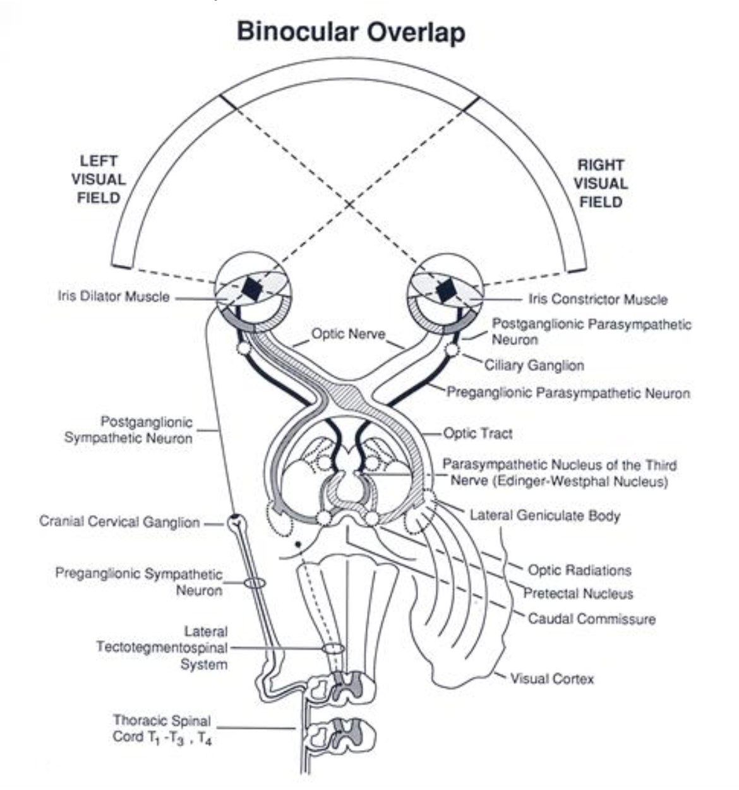

The most common ophthalmic manifestations of neurologic disease are
abnormal pupil sizes, abnormal pupillary light responses (PLRs), and
blindness. Menace responses and PLRs should be done on all ophthalmic
examinations. Less commonly seen are abnormalities of eyelid position or
abnormal position of the eyeball itself; we will not discuss either of
these.

The primary receptors for the pupillary response and vision are the rods
and cones from which electrical impulses pass to bipolar cells. From
bipolar cells, impulses continue to retinal ganglion cells, the axons of
which constitute the optic nerve. At the optic chiasm, part of the nerve
fibers decussate (cross over); in most mammals, the fibers from the
lateral part of the retina do not decussate much. The fibers continue
from the optic chiasm as optic tracts (same axons). In the optic tracts,
visual and pupillary fibers begin to differ in pathways.

The visual fibers synapse in lateral geniculate bodies and travel via
optic radiations to the occipital cortex. The pupillary fibers continue
to the midbrain to synapse in the pretectal nuclei (crossing occurs
between the nuclei of the two sides). The pretectal nuclei fibers
project and synapse in the oculomotor nuclei (both oculomotor nuclei
receive axons of neurons from each pretectal nucleus). Preganglionic
parasympathetic axons of the oculomotor nerve synapse in both ciliary
ganglia. Postganglionic parasympathetic fibers innervate the iris
sphincter and ciliary muscles.

Sympathetic innervation of the iris is necessary to provide control of
pupil size by providing constant antagonism to the sphincter via the
dilator muscle. The sympathetic impulses originate in the hypothalamus
and rostral midbrain, pass to and synapse in the intermediate gray
column of the first three thoracic segments of the spinal cord.
Preganglionic sympathetic neurons pass to the thoracic sympathetic
trunk, go cranially (usually without synapse in the intervening
cervicothoracic and middle cervical ganglia) to enter the cervical
sympathetic trunk. At the cranial cervical ganglion synapse occurs and
postganglionic fibers concerned with pupil size pass to the dilator
muscle of the iris (note: some sympathetic fibers have been found in the
sphincter muscle and probably have an inhibitory function).

Be aware!! There are several non-neurologic causes of abnormal pupil
sizes and/or PLRs. The most common examples are iris atrophy and
synechia. Make sure you can differentiate these disorders from
neurologic causes of pupillary abnormalities.

Essentials of Neuroophthalmic Examination
=========================================

-   Pupillary Light Response:

    -   Direct - Response of pupil when light is shone in that eye.

    -   Consensual - Response of pupil when light is shone in opposite
        eye.

    -   Swinging flashlight test - Shine light in OS wait 2-3 seconds
        for pupils to constrict quickly bring light over to OD if OD
        was already constricted, then consensual OD was normal. If OD
        was not constricted, consensual OD not normal. If the OD pupil
        was constricted, it will not redilate in the short amount of
        time it takes to move the light from OS to OD.

-   Menace Response

    -   The menace response is present at birth (or within 1-2 weeks) in
        horses and other prey animals. It is a learned response in
        puppies and kittens, and therefore maybe absent in normal young
        predators until learned (about 7-8 weeks). When making the
        menacing gesture, avoid air movements and touching hair on the
        face.

-   Dazzle Response

    -   This is the involuntary avoidance response to a light shone into
        the eye. Especially when a strong light is directed at the eye,
        there will be blinking and possibly retraction of the globe with
        protrusion of the third eyelid and sometimes movement of the
        head away from the light. Although the neuroanatomical pathway
        for this response is not completely understood it is thought
        that the optic tract axons synapse in the rostral colliculus. A
        positive response generally is considered to be evidence of
        fundamental continuity of the eye to brain pathway and is
        suggestive that there may be the ability for vision. The
        presence of complete cataracts or corneal scarring would not be
        expected to prevent this response.

-   Cotton Ball Test

    -   A cotton ball is thrown in the line of sight and tracking is
        evaluated.

-   Maze Test

    -   Observe animal as it ambulates off leash around exam room with
        obstacles created from chairs, trash cans, etc.

Neuroophthalmic Diseases
========================

Horner’s Syndrome
-----------------

-   Definition:

    -   Lack of sympathetic innervation to the eye and orbit.

    -   Clinical signs / history:

        -   Signs generally unilateral

        -   Miosis (but direct and consensual PLRs are positive)

        -   Enophthalmia

        -   Protrusion of the third eyelid

        -   Ptosis of the upper lid

        -   May have history of trauma

    -   Review sympathetic pathway to eye

-   Etiologies:

    -   Any lesion of the sympathetic pathway can cause Horner’s
        syndrome.

    -   Otitis media

    -   Neck trauma (leash, dog fight)

    -   Idiopathic – about 70% of Horner’s cases in dogs fall in this
        category

-   Diagnosis:

    -   Appropriate collection of clinical signs

    -   Pharmacologic localization to detect post-ganglionic lesions;
        phenylephrine most reliable

    -   Pharmacologic localization only partly accurate due to
        unpredictable penetration of cornea by drugs. Additionally,
        denervation hypersensitivity takes days to weeks to develop.

        -   Phenylephrine test

            -   Apply one drop of 10% phenylephrine to each eye (the
                normal eye is serving as control)

            -   Observe pupils every 10-20 minutes

            -   Phenylephrine will dilate a normal pupil within about
                1-2 hours, but will dilate a pupil with postganglionic
                (i.e., third order) Horner’s much faster, usually within
                20-30 minutes

    -   Should always do deep cervical palpation and flexion, as well as
        otic exam.

    -   Consider MRI, chest films in selected cases.

-   Treatment:

    -   Treat otitis if discovered.

    -   Otherwise, leave alone; many cases resolve in weeks to months

Dysautonomia
------------

-   Definition:

    -   Loss of autonomic innervation; includes systemic as well as
        ocular dysfunction, and sympathetic as well as parasympathetic.

    -   Clinical signs / history:

        -   Bilateral

        -   Regurgitation (megaesophagus)

        -   Constipation

        -   Fecal and urinary incontinence

        -   Decreased STT

        -   Dilated nonresponsive pupils

        -   Third eyelid protrusion

-   Etiology

    -   Unknown; was seen as an epidemic in early ‘80’s in Britain, and
        another more recent epidemic in hunting dogs in Kansas.
        Postulated environmental, infectious causes.

-   Diagnosis:

    -   Proper spectrum of clinical signs.

    -   Dilute pilocarpine to evaluate for parasympathetic denervation
        hypersensitivity of pupil

-   Treatment:

    -   Supportive for dry eye, regurgitation, and constipation.

-   Prognosis very poor.

Cortical Blindness
------------------

-   Definition:

    -   Inability to see due to lesion of visual cortex.

-   Clinical signs/history:

    -   Usually have other neurologic signs of cortical disease
        (seizures, ataxia, etc.)

    -   PLRs normal

-   Etiologies:

    -   Infectious

    -   Neoplastic

    -   Vascular

    -   Hydrocephalus

-   Diagnosis:

    -   Blindness with normal PLRs

-   Treatment:

    -   Treat underlying brain disorder

**Exercise: Localize the lesion**

<table>
<colgroup>
<col style="width: 50%" />
<col style="width: 50%" />
</colgroup>
<thead>
<tr class="header">
<th>Clinical signs</th>
<th>Site of Lesion</th>
</tr>
</thead>
<tbody>
<tr class="odd">
<td>
Blindness OS, negative direct PLR OS, negative consensual PLR OD
</td>
<td></td>
</tr>
<tr class="even">
<td>
Blindness OS, negative direct PLR OS, negative consensual PLR OD, positive ERG OS, negative VEP OD, ERG and VEP positive OS
</td>
<td></td>
</tr>
<tr class="odd">
<td>
Blind OU, negative direct and consensual PLR OU
</td>
<td></td>
</tr>
<tr class="even">
<td>
Visual OU, negative direct and consensual PLR OD, positive direct and consensual PLR OS
</td>
<td></td>
</tr>
<tr class="odd">
<td>
Blind OU, positive direct and consensual PLR OU
</td>
<td></td>
</tr>
</tbody>
</table>
