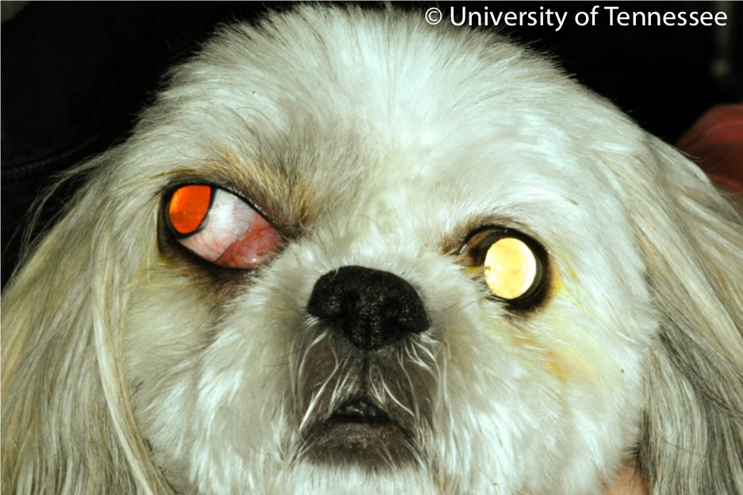
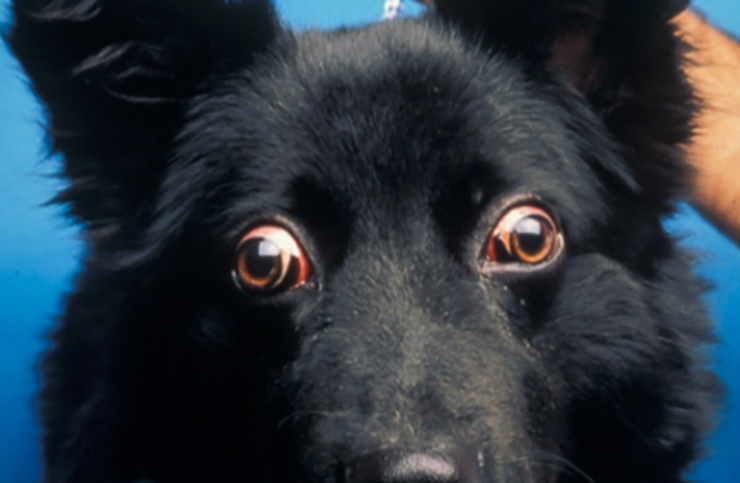

# Orbit 
[[toc]]

## Functional Anatomy of the Orbit

The orbit refers to the bone and muscle that surrounds and protects the eye. 

While the globe occupies the majority of space within the orbit (especially in brachycephalics), there is also fat, muscles (e.g. extraocular muscles), and associated nerves and vasculature. In addition, the lacrimal gland and a portion of the zygomatic gland are contained within the orbit. This is somewhat relevant when considering differentials for tumors and for changes in the globe position.

The space behind the eye is referred to as the "retrobulbar space" and the volume of that spaces varies significantly depending on the skull conformation. Broadly there are three forms, from increasing to decreasing volume: dolicocephalic, mesacephalic, and brachycephalic (this last one keeps us in business!).

::: detail Cephalicness and impact on ocular health
Cephalicness is calculated based on a ratio of head width to head length. Brachycephalics have large indexes as their heads get wider and the length gets shorter. The contents in the "middle" get distorted by the altered anatomy and this distortion results in increased risk for ulceration or conjunctivitis^[Packer RM, Hendricks A, Burn CC. Impact of facial conformation on canine health: corneal ulceration. PLoS One. 2015;10(5):e0123827. Published 2015 May 13. doi:10.1371/journal.pone.0123827].

Overall brachycephalics have shallower orbits which leads to exophthalmia/lagophthalmia which results in more prominence for trauma. In addition, corneal sensitivity in these dogs is lowered ^[Barrett, P.M., Scagliotti, R.H., Merideth, R.E., Jackson, P.A. & Alarcon, F.L. (1991) Absolute corneal sensitivity and corneal trigeminal nerve anatomy in normal dogs. Progress in Veterinary & Comparative Ophthalmology, 1, 245–254.] which can result in slower reaction times to trauma, lowered tear production, etc. which may all play into the reason why these dogs can be ophthalmological nightmares.
:::

## Clinical Signs Associated with Diseases of the Orbit

The main clinical sign associated with diseases of the orbit is **exophthalmia** which is an abnormal protrusion or bulging forward of the eye. Somtimes this can be seen as an overall increase in prominence in the globe but can also be noted if the eye is shifted out of the normal axis.

While it is possible to quantitatively measure degree of exophthalmia (with a device called exophthalmometer) most of the time it's possible to guage exophthalmia by guaging symmetry from various angles as illustrated below.

Other times there may other clinical signs signs as strabismus (e.g. an eye that points in abnormal direction) or a persistently elevated third eyelid. The latter can be from a mass pushing the third eyelid forward or pushing the eye forward and trapping the third eyelid in an anterior position. Reduced retropulsion is also noted.

::: warning
It's important to differentiate exophthalmia from **buphthalmia** which is enlargement of the globe itself. Both can result in a "prominent" eye but the latter is an eye that is physically larger. Both can have decreased digital retropulsion.

How can you tell the difference?

* If there's a "normal" eye - compare corneal diameters (STT tear strips are handy for this). In exophthalmia they will be about the same (like within 1 mm of each other), in buphthalmia, the larger eye will have a greater corneal diameter.
* About the only thing that will result in buphthalmia is glaucoma - most of these eyes will be blind or have other concurrent signs of glaucoma. [**You probably can rattle off the most common clinical signs of glaucoma, but click here if for some reason you can't.**](../glaucoma/glaucoma.md#clinical-and-pathologic-effects-of-elevated-iop)
:::

## Clinical Approach to Exophthalmia
The main etiologies for exophthalmia can usually be divided into two big categories - **inflammatory** -or- **neoplastic**. Determining which category can be done with the following (from least to most invasive/expensive):

| Clinical Assessment       | Inflammatory  | Neoplastic |
|---------------------------|----------------------------|--------------------------------------|
| History                   | Acute presentation         | Chronic/slow presentation |
| Signalment                | Generally younger (~ 4 yo average ) | Generally older (~ 9 yo average) |
| Ophthalmic Exam           | Can have pain/tenderness when manipulating eye or head  | May not show any obvious comfort but some tumors can be painful (e.g. with bone lysis or secondary inflammation)|
| Oral Exam                 | May be difficult to perform - animal may protest, if under general anesthesia or heavy sedation, exam area just behind the molars for swelling/redness | Not as painful to open the mouth, may be clinically normal |
| Bloodwork                 | Inflammatory leukogram (e.g. neutrophilia) | Normal-ish |
| Ultrasound                | Most can be cellulitis so no obvious "mass" or "abscess" but sometimes might see hypoechoic region to try to FNA/tap    | Mass or mass-effect can potentially be seen for FNA |
| Advanced Imaging (CT/MRI) | Most definitive way to determine lesion and extent of lesion, contrast is helpful for assessing inflammatory area | Most definitive way to try to determine lesion or tissue of origin (e.g. nasal tumors can extend into the orbit) - can use CT to obtain FNA sample |

See below for further details on each condition.

## Etologies for Exophthalmia

### Retrobulbar Cellulitis/Abscess

Retrobulbar inflammation can be generalized (cellulitis) or organized (abscess) to the tissues behind the globe. Both can result in significant exophthalmia. Pain is most often noted when opening (or trying to open) the mouth as the ramus of the mandible will extend into the orbit on opening and this results in significant discomfort with cellulitis (i.e. moving a bone into inflammed tissues is going to hurt). The orbital or periorbital tissues may also be painful upon palpation and  the surrounding tissue around the eye such as the conjunctiva may also be inflammed or significantly swollen (chemotic).

The source of the inflammation can be from organisms that enter behind the eye from a bone or stick that punctures through the pterygoid muscle behind the last molar, from infected molar roots, or from other neighboring structures (e.g. nose & ear - probably would have to be pretty significant if it crosses through all the neigboring structures or bone). Additionally, it's thought that hematogenous spread is also possible - where are how this happens is unknown.

Definitive diagnosis usually requres with imaging and getting a sample that is deemed infected or solely inflammatory. A high index of suspicion for cellulitis should be held if the history and clinical signs are consistent with what is noted [in the table above under the "inflammatory" column](#clinical-approach-to-exophthalmia) but neoplasia should always also be a differential.

#### Medical Treatment for Cellulitis/Abscesses

Most cases of cellulitis tend to respond well to oral or parental (if the animal cannot or will not open their mouths) antibiotics and usually within a week there is clinical improvement. If there is no improvement or if there is abscess present then surgical drainage may be required.

In cases where advanced imaging is not feasible or readily available, recommend to the owner to perform baseline bloodwork and begin empirical treatment with a broad spectrum antibiotic. In a paper^[Wang AL, Ledbetter EC, Kern TJ. Orbital abscess bacterial isolates and in vitro antimicrobial susceptibility patterns in dogs and cats. Vet Ophthalmol. 2009;12(2):91–96. doi:10.1111/j.1463-5224.2008.00687.x] examining orbital abscess culture and sensitivities, the authors found mixed aerobic and anaerobic bacterial infections and essentially recommended cephalosporins, extended-spectrum penicillins, potentiated-penicillins and carbapenems (see below for an excerpt from the paper with the relevant details).

If there is improvement, the antibiotics should be continued for at least 2-3 more weeks while monitoring for recurrence after stopping. If there is a persistent foreign body, then it's possible for the clinical signs to recur and the owner should be warned of this so that they can be prepared to move forward with additional diagnostics (e.g. imaging) if needed.

Long-term prognosis for these animals are generally good and vision preserved if the inflammation/infection is controlled early. Enophthalmia can result after all the swelling resolves.

::: detail Associated organisms and sensitivities/antibiotics to use
Wang et al's paper on orbital abscesses has some nice information on type of bacteria present and sensitivies associated to those bacteria^[Wang AL, Ledbetter EC, Kern TJ. Orbital abscess bacterial isolates and in vitro antimicrobial susceptibility patterns in dogs and cats. Vet Ophthalmol. 2009;12(2):91–96. doi:10.1111/j.1463-5224.2008.00687.x]. List of cultured organisms include:  
* Dogs: Staphylococcus, Escherichia, Bacteroides (anaerobic), Clostridium (anaerobic) and Pasteurella 
* Cats: Pasteurella and Bacteroides (anaerobic)

When it comes to which antibiotics to use, to quote the study:
> Given the high incidence of mixed or pure anaerobic bacterial infection in this report, **cephalosporins, extended-spectrum penicillins, potentiated-penicillins, and carbapenems** are recommended for empiric monotherapy of orbital abscesses in dogs and cats as the majority of aerobic bacterial isolates tested in this study were susceptible to these antimicrobials and they are effective against most obligate anaerobic bacteria. 

>Clindamycin and amoxicillin-clavulanic acid are among the most frequent empiric therapeutics recommended for orbital abscess in dogs and cats. The results of this study suggest that, of these two antimicrobials, amoxicillin-clavulanic acid would be preferable as 80% of canine and feline aerobic bacterial isolates were susceptible to this medication, but only 42.9% of aerobic bacterial isolates were susceptible to clindamycin
:::

#### Surgical Treatment for Abscesses ####

If an abscess is noted or if the animal is not responding to medical management within a reasonable timeframe (~1 week) then surgical treatment may be required.

Advanced imaging is recommended to localize the pocket(s) present and the best approach for drainage however the site can be attempted to be drained surgically through the mouth. The procedure is as follows:

1. Anesthesize the animal (usually want an ET tube so pus doesn't go pouring down the trachea and also even heavy sedation may not be enough to blunt the pain from opening the mouth or provide enough muscle relaxation)
2. Open the mouth (duh)
3. Locate the area behind the last molar (may be red or swollen)
4. Make a small incision with a 15 blade through the oral mucosa
5. *Gently* insert a closed pair of straight mosquito hemostats -- you don't have to go far, the distance to the retobulbar space from that point is very short
6. *Gently* open the hemostats and withdraw the hemostats -- don't dig or wiggle, a lot of delicate stuff back there
7. If exudate comes out, can obtain a sample for culture, let as much of it out as possible
8. Clean out any exudate from the oral cavity to prevent aspiration
9. Leave the area open to heal by second intention

If the oral approach fails, there are a couple papers that describe various techniques of orbitotomies that can be performed to drain an orbital abscess^[Tremolada G, Milovancev M, Culp WT, Bleedorn JA. Surgical management of canine refractory retrobulbar abscesses: six cases. J Small Anim Pract. 2015;56(11):667–670. doi:10.1111/jsap.12398]^[Vallefuoco R, Molas C, Moissonnier P, Chahory S. Lateral orbitotomy for treatment of an orbital abscess in a dog. J Small Anim Pract. 2014;55(10):531–534. doi:10.1111/jsap.12231]. There's nothing terribly complicated about the orbitotomies but there is typically removing of some bone (the zygomatic process) which gives most ophthalmologists the heeby-jeebies^[If there's anything that is the antithesis of delicate eyeball surgery it's cutting bones] so typically a surgeon is involved or consulted (or if immediately available, turfed the case).

### Retrobulbar Neoplasia

Neoplasia of or in the orbit is another possible etiology for exophthalmia and is an important differential for a slow growing change in an elderly animal [(see chart above for more clues)](#clinical-approach-to-exophthalmia).

Pooling the data of reported frequency from a few papers, the most common tumor type are mesenchymal tumors (e.g. fibrosarcoma, osteosarcoma), followed by carcinomas (e.g. adenocarcinoma of the gland of the third eyelid) , and then miscellaneous (e.g. peripheral nerve sheath tumor, meningioma, mast cell tumor). The majority of these tumors are primary orbital tumors and malignant. Nasal tumors and parasinus tumors are also known to lyse through the bone into the orbit - usually with subsequent lateral deviation of the globe, third eyelid protrusion, altered air flow, etc.

Diagnosis of orbital tumors usually requires advanced imaging. CT is good for bony definition can be performed quickly with guided FNAs done to determine the tissue of origin. MRIs are helpful for soft tissue evaluation such in cases of suspected meningiomas (these dogs are blind and may exhibit changes to their optic nerve on fundic exam). The owner should be prepped for biopsying with advanced imaging, as a tissue sample is crucial in determining prognosis and confirming a diagnosis.

*In general, orbital tumors are malignant, aggressive, and have a very poor prognosis for the animal.* Sadly, many of these animals with orbital tumors are euthanized shortly after diagnosis. If treatment is desired, depending on the tumor type and origin, surgical resection with an exteneration can be performed, in addition to radiation, and potentially chemotherapy.

<figure>
  
		<figcaption>
		<b>Dog with Retrobulbar Neoplasia</b>
		

			<ul>
			<li>Globe deviated dorsolaterally</li>	
			<li>Elevated third eyelid</li>	
			<li>Chronic history (not pictured)</li>	
			<li>Nonpainful</li>	
			</ul> 
		

	</figcaption>
</figure>

### Traumatic Proptosis

Probably as exophthalmic an animal can get short of being enucleated. The globe is not just displaced forward but then is *trapped* in front of the eyelids - trying to push the globe back when this happens is hard as the lids generally prevent the globe from returning. This usually happens from trauma (e.g. dog fight, hit by car) and occurs easily in brachycephalics in particular. If the trauma is particularly severe, extraocular muscles will be torn - typically the medial rectus first since it is the shortest. Damage to enough of the extraocular muscles will affect vascular circulation to the eye.

Treatment for a proptosis should be done after ensuring the animal is otherwise stable if the trauma to the head was significant or life threatening - protosis, while gruesome, is not generally life threatening. Enucleation in severe cases is called for especially if there's a high chance for blindness or KCS post-proptosis or if the damage to the eye is severe (if you can see the optic nerve, chances are the eye should be removed). Dolicocephalics and mesocephalics have a particularly poor prognosis given that it takes more trauma to proptose their eyes versus a brachycephalic.

As mentioned above, sequelae for proptosis include lateral strabismus (from tearing of the medial rectus muscle), keratoconjunctivitis sicca/dry eye, and blindness. Owners should be prepared for these possibilities including longterm treatment for KCS.

#### Reduction of the Globe
1. Clean the globe off thoroughly (e.g. road debris)
2. Place suture into the posteriorly displaced eyelids from upper to lower lid in a vertical mattress pattern
3. Push on the globe while pulling up on the suture (allows the lids to wrap around the globe like it should)
4. Place a temporary tarsorrhaphy (usually can't use the original sutures used in step #2 because they aren't anterior to the margin enough -- so pull them out if appropriate).
5. Send home oral antibiotics and oral anti-inflammatories x 1-2 weeks
6. Leave tarsorrhaphy in place for at least 2-3 weeks while swelling subsides
7. Check after a week or two to make sure sutures do not loosen to the point where they touch the cornea
8. When the swelling is mostly gone, remove tarsorraphy sutures and examine the eye

### Other (strange or less common) Causes

#### Extraocular Myositis
This is a relatively uncommon condition that is usually seen in young Golden Retrievers. As the name would suggest, there is inflammation of the extraocular muscles of the eye which causes a very unique-looking exophthalmos where there is a perpetual look of surprise or shock on the dog's face (see below). The condition is **bilateral** and is usually not overtly painful in contrast to retrobulbar cellulitis.

Treatment is with immunosuppressive doses of steroids (1-2 mg/kg/day) - the author will usually do it for about a month and then gradually taper. Long-term treatment may be needed (i.e. when the dog starts to look surprised again when tapering down steroids) and transitioning to a less steroid-side-effectless medication like azathioprine or mycophenolate can be done as well with proper and regular monitoring for adverse side effects. Consult your local friendly internist or ophthalmologist for guidelines on immunosuppresssive use if there are questions or concerns. 
<figure>
  
		<figcaption>
		<b>Clinical Appearance of Extraocular Myositis</b>
		

			<ul>
			<li>Increased scleral show (shouldn't be able to see as much of the sclera as shown here)</li>	
			<li>Elevated third eyelids</li>	
			<li>Symmetrical change bilaterally</li>	
			</ul> 
		

	</figcaption>
</figure>

#### Masticatory Muscle Myositis (MMM)
Another rare disease of young GSD or Weimaraners, this particular condition affects the temporalis, masseter, and ptygeroid muscles of mastications which contain a specialized muscle fiber (2M) which then becomes the target of the immune system. 

Affected dogs are usually more clinical than the extraocular myositis cases and can present with obvious temporal muscle swelling, lethargy, exophthalmia, limited mouth movement, and can have inflammatory changes on bloodwork. The condition is bilateral. Definitive diagnosis can be performed by looking for 2M antibodies in the blood or through a muscle biopsy. The test is not widely available and usually is sent to a specialized lab^[UC San Diego Comparative Neuromuscular Laboratory - see their website at for submission information: [http://vetneuromuscular.ucsd.edu/forms.html](http://vetneuromuscular.ucsd.edu/forms.html). Note: Some big commercial labs will include 2M antibody testing but basically are just the middlemen to this laboratory.].

#### Salivary Mucocele or Cysts
Mucoceles result from leakage of saliva from the salivary gland which induces an inflammatory reaction in the surrounding tissue. Diagnosis is made from clinical signs and results of diagnostic imaging of the orbit (MRI/CT or potentially ocular ultrasound). Surgical excision is the best treatment and is recommended to be performed by a surgeon. Medical treatment for a mucocele with polidocanol has also been reported as long as the mucocele can be accurately aspirated and injected^[Stuckey JA, Miller WW, Almond GT. Use of a sclerosing agent (1% polidocanol) to treat an orbital mucocele in a dog. Vet Ophthalmol. 2012;15(3):188–193. doi:10.1111/j.1463-5224.2011.00936.x].

Salivary cysts have a similar tissue of origin (orbital or periorbital glandular tissue) and a similar appearance on imaging but have true epithelial-lining in contrast to mucoceles. Cysts can be drained and reports of use of polidocanol (a sclerosing agent) has been reported and anecdotally used for treatment^[Zimmerman KL, Stefanacci JD, Greenberg SM. Use of 1% polidocanol and pre- and post-computed tomography for treatment of a suspected nasolacrimal duct cyst in a dog. Vet Ophthalmol. 2019;22(3):374–380. doi:10.1111/vop.12644].
