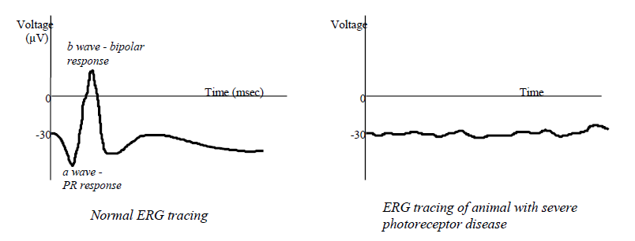
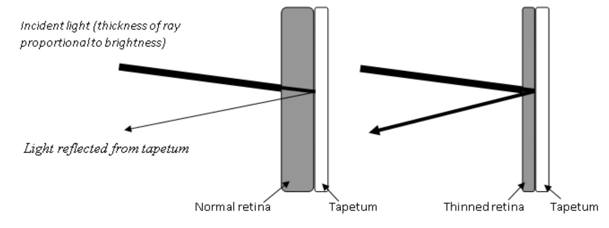

Review of Fundus Histology and Physiology
=========================================

First of all, what’s all this about a fundus? I thought that was part of
the stomach!?!?

-   To an ophthalmologist, the fundus is the inside of the back of the
    eyeball. Evaluation of the fundus includes evaluation of the retina,
    choroid and sclera.

-   Be sure to thoroughly review the retinal portion of your anatomy lab
    session from earlier in the term.

Retina – There are about 60 cell types in the retina, but the most
important are the retinal pigment epithelium (RPE), photoreceptors (rods
and cones), bipolar cells, and ganglion cells. Neural transmission
(labelled “signal transduction” in the cartoon below) starts in the
photoreceptor and proceeds to the bipolar then to the ganglion cells.
Therefore the “neurosensory retina” is everything minus the RPE.
Rhodopsin (a combination of retinaldehyde and the protein opsin) is the
photopigment in the rods that binds to photons of light. Iodopsin is the
photopigment in cones. The optic nerve is collection of ganglion cell
axons that travel to the brain. Rod cells respond to dim light and are
particularly sensitive to movement in the visual environment. Cone cells
have differential “spectral sensitivities” that impart color vision, and
they only respond to bright light

Choroid - between the retina and sclera. Contains the tapetum (if one is
present), heavy pigmentation in most individuals (although nonpigmented
choroidal tissue is a normal variation), and many vessels. The choroidal
vasculature has three relatively distinct layers of vessels: a large
vessel layer posteriorly, a layer of somewhat smaller vessels anterior
to the large vessel layer, and a capillary layer (called the
choriocapillaris) anterior to that. The choroid is part of the uveal
tract, and like the entire uveal tract it is highly vascular. In the dog
(in many species, in fact) the choroid provides a great deal of the
nutrition to the retina.

Sclera - exterior to the choroid. Relatively acellular, avascular, and
essentially nonpigmented.

Evaluation of the Retina and Optic Nerve
========================================

Techniques used in examination of the retina

-   Principal exam technique is **ophthalmoscopy**. This may include
    direct and indirect ophthalmoscopy, with the indirect technique
    being the preferred method (you need to review advantages /
    disadvantages of indirect vs. direct ophthalmoscopy.

-   **Indirect ophthalmoscopy** should be done in a systematic fashion
    to avoid overlooking lesions because you forgot to look for them:

    1.  Optic disc – evaluate for:

        -   Size and shape, which are highly variable in dogs

        -   Color - normal is a whitish-salmon pink color

        -   Is the disc in the same plane as the retina, or is it
            depressed or elevated?

        -   Physiologic pit - a small central depression representing
            the caudal course of the ganglion cell axons as they head
            caudally towards the brain.

        -   The feline disc is not myelinated, and is therefore round
            and darker.

    2.  Vessels

        -   Number of vessels - there is generally a triad or tetrad of
            major vein-artery pairs, with a number of smaller arterioles
            and venules between them. Veins usually extend to the center
            of the disc (where they often join in an anastomotic arc or
            circle), while arterioles do not.

        -   Caliber or width of vessels. The veins have a larger
            diameter than the arteries.

        -   Number of vascular crossings….if you’re not seeing many
            crossings, it’s probably due to a decrease in the number of
            vessels.

        -   Degree of branching of the vessels

        -   Do the vessels go all the way to the periphery?

    3.  Tapetum

        -   Please be aware that the tapetum is actually a choroidal
            structure, not a retinal structure.

        -   Homogeneity - If the tapetum is the same everywhere, it is
            probably normal for that animal. The absence of a tapetum in
            a species that usually has a tapetum is considered a normal
            variation - this is most often seen in “color dilute”
            individuals (e.g., Siberian huskies, merle collies).

    4.  Nontapetum

        -   As with the tapetum, most of what you’ll see in the
            nontapetum (which is typically going to be dark brown
            pigment, and sometimes choroidal vessels) is in the choroid,
            not the retina.

        -   Homogeneity - again, if it’s the same everywhere it’s
            probably normal.

        -   Depigmented lesions - usually indicate retinal scarring. But
            be aware that there is a lot of individual variation in the
            amount of nontapetal pigment, which exposes the underlying
            choroidal vasculature.

**Pupillary light responses** - direct and indirect

**Menace response**

**Tracking (cotton balls)/Maze test**

**Dazzle response**

**Electroretinogram (ERG)**

-   Measures electrical activity in the retina in response to a flash of
    light.

-   By using various combinations of dark adaptation and colored
    filters, can separate rod and core contributions of the ERG.

-   Only the photoreceptors and dipolar cells contribute to the ERG; the
    ERG can be normal even if the optic nerve is transected.

If a dog is blind and the ERG is normal, a CT or MRI is usually
indicated as the disease is caudal to the retina.

**Visual Evoked Potential (VEP)**

-   Measures electrical activity in the visual cortex in response to a
    flash of light.

-   Photoreceptors, bipolar cells, ganglion cells, optic nerve, and
    visual cortex must all be intact to have a normal VEP

Retinal Diseases
================

Developmental Abnormalities
---------------------------

### Collie Eye Anomaly

-   Definition: Inherited, congenital malformation of fundus of Collies.
    Primary defect is one of maldifferentiation of the neural crest
    cells (your text inaccurately says “mesodermal”) in the posterior
    pole of the eye resulting in lesions described below.

-   Clinical signs/history:

    -   Usually no signs or significant history. A small number of these
        animals are blind, and may therefore present with that
        complaint. Most are discovered incidentally, or when owners
        familiar with the syndrome ask you specifically to look for it.

-   Ophthalmoscopic appearance:

    -   Focal area of choriodal hypoplasia temporal to the optic disc.
        BASIC LESION OF THIS SYNDROME! Vision unimpaired

    -   Optic disc coloboma. Vision usually unimpaired

    -   Retinal detachment. Blind.

    -   Intraocular hemorrhage. Blind.

    -   These lesions build on one another; i.e., can’t have coloboma
        without hypoplasia, etc.

-   Etiology:

    -   Inherited; autosomal recessive. Multiple phenotypes, but only
        one genotype!!

-   Other general features of this syndrome:

    -   Estimates put number of affected dogs in US at 70 - 90%.

    -   Most dogs affected with hypoplasia. Only about 5% have blinding
        manifestations – thus the perpetuation of the myth that the
        condition “breeds true” phenotypically.

    -   Nonprogressive, but beware of “Go-normals”

    -   Other Collie-ish breeds are affected (Sheltie, Border Collie,
        Aussie, G. Shepherd), but at nowhere near the frequency of
        Collies.

-   Treatment

    -   None. Counsel owner as to maintenance of a blind animal if, in
        fact, animal is blind. Do not breed, regardless of the
        manifestation.

### Merle Ocular Dysgenesis

-   Red and Blue Australian Shepherds

-   Clinical signs

    -   Microphthalmia

    -   Heterochromia, dyscoria, corectopia

    -   Cataracts

    -   Large equatorial staphylomas (i.e., outpouchings of sclera)

    -   Retinal detachments

-   Etiology

    -   Inherited: autosomal recessive, incomplete penetrance

    -   Affected animals are homozygous for the merling gene and are
        excessively white

### Retinal Dysplasia

-   Definition: Congenital maldevelopment and improper differentiation
    of the neurosensory retina. Can be either inherited or due to
    various in utero insults during the period of retinal
    differentiation.

-   Variations and Breeds

    -   There is a tremendous amount of controversy about the
        categorization of the retinal dysplasias, especially the
        inherited ones. We will use the following scheme for now as
        though its “gospel,” but just keep in the back of your mind that
        it’s an oversimplification:

        -   Multifocal - Inherited in many breeds (most notably the
            Cocker Spaniel).

        -   Geographic (also called generalized) - English Springer
            Spaniel, Labrador

-   Multifocal Retinal Dysplasia

    -   Clinical signs/history

        -   None. An incidental finding on routine retinal exam; some
            breeders request a retinal exam so they can discover this
            problem in their breeding animals.

    -   Ophthalmoscopic / histologic appearance

        -   Histologically, retina is thrown into folds, or
            photoreceptors are disorganized into “rosettes.”

        -   Linear, dot shaped, or vermiform streaks in tapetum or
            nontapetum.

        -   In tapetum, usually green or gray lesions, sometimes
            surrounded by hyperreflectivity

        -   In nontapetum, usually white lesions.

        -   Can see identical fold lesions in some animals that are not
            due to abnormal retinal differentiation, but rather due to
            different growth rates of the neurosensory retina and the
            remainder of the posterior pole of the eye – these disappear
            as animal grows (most commonly seen in Collies).

    -   Etiology

        -   Inherited, autosomal recessive

    -   Treatment

        -   No treatment available or needed. These lesions are
            nonprogressive and do not cause noticeable visual
            impairment.

-   Geographic Retinal Dysplasia

    -   Clinical Signs/history

        -   Depends on severity; usually some degree of visual
            impairment, sometimes completely blind. Occasionally no
            noticeable visual impairment.

    -   Ophthalmoscopic / histologic appearance

        -   Histology - Large coalescing areas of folds, rosettes

        -   Ophthalmoscopy - Large pigment clumps in tapetum, usually
            immediately superior to the optic disc. Clumps are usually
            surrounded by hyperreflectivity. In the more severly
            affected animals, the retina may be detached.

    -   Etiologies

        -   English Springer - Inherited; autosomal recessive. Will
            sometimes see multifocal lesions in Springers as well.
            Because relationship of these lesions to the geographic
            lesions is unknown, it is recommended to assume all Springer
            dysplasias are serious and warrant not breeding.

        -   Labrador Retriever - Inherited. Skeletal dwarfism may
            accompany this lesion. Prevalent thought is that these
            lesions are caused by a single gene that has recessive
            effects on the skeleton, incomplete dominant on the retina.
            Homozygotes are dwarfed, have the most severe ocular
            lesions, heterozygotes have milder ocular lesions (sometimes
            just multifocal), and no skeletal lesions.

    -   Treatment

        -   None. Even though there is debate about the genetics in
            these breeds and whether or not multifocal syndromes
            unrelated to the geographic syndromes exist, it is currently
            recommended that they not be bred regardless of the severity
            of the dysplasia in these breeds.

Canine Multifocal Retinopathy
-----------------------------

-   Definition

    -   An unusual early onset (10-12 weeks) retinopathy manifesting as
        focal to multifocal serous retinal detachments

-   Breeds: Pyrenees, Coton du Tulear, Mastiff

-   Clinical signs/history

    -   None. An incidental finding on routine retinal exam; some
        breeders request a retinal exam so they can discover this
        problem in their breeding animals.

    -   Ophthalmoscopic appearance

        -   Multifocal gray to tan fundic patches varying in size from
            pinpoint to about the size of the optic disc

        -   Lesions often near the optic disc and around major veins

-   Etiology

    -   Inherited, autosomal recessive. Mutation in the BEST1 gene

-   Treatment

    -   No treatment available or needed. These lesions are
        nonprogressive and do not cause noticeable visual impairment

Inherited Retinal Degenerations
===============================

This set of retinal diseases is characterized by retinas that develop in
pretty good shape, at least up until the time of birth. This may seem an
odd statement at first….after all, isn’t the body pretty much developed
at birth, with only growth and some “fine tuning” and refinement
occurring thereafter? Turns out that the canine retina is not fully
developed at birth…..in fact, this is true of many species. The pieces
and parts are pretty much all there, but histologically and functionally
the retina is not that of a mature dog until 7-8 weeks of age. This can
be appreciated from the fact that the ERG is not “mature” until that
time, the menace response is often absent until that time, and even the
appearance of the retina changes during that time (e.g., the tapetum, if
the dog is destined to have one, goes from a dull gray color, to a
bluish violet (similar to Elizabeth Taylor’s iris color) to whatever
it’s adult coloration is going to be (generally a yellow or green) over
about an 8 week period).

The first two categories of Inherited Retinal Degenerations (Early Onset
Photoreceptor Degenerations and Late Onset Photoreceptor Degenerations)
are collectively called **Progressive Retinal Atrophy (PRA)**. PRA is
usually spoken of as if it were a single disease, with a given etiology,
set of clinical signs, clinical progression, ophthalmoscopic appearance,
treatment (spoiler alert: there isn’t one!), and prognosis. But PRA is
probably more appropriately discussed as a group of diseases, ***the
PRAs***, because the underlying genetic mutations and resulting cellular
pathologies can be very different from breed to breed. So below we will
start with a discussion of PRA as a single disease entity (highlighting
the similarities), then we will give a brief overview of the individual
PRAs that represent both early onset photoreceptor degenerations and
late onset photoreceptor degenerations.

A word of warning: as the PRAs have been discovered over the past 100+
years, there has not been a consistency in the way they were named….some
were named after what was occurring histologically (e.g., rod-cone
dysplasia in Setters, Collies and Corgis…..because while the retina in
general develops normally up until the time of birth, further postnatal
development is dysplastic), while others have more of a clinical
description (e.g., early retinal degeneration in Elkhounds….because the
retina apparently develops normally in the early postnatal months, but
structure and function fade shortly thereafter). Sorry about that…if it
were left up to me, I’d have called them PRA1, PRA2, PRA3, etc., but
nobody asked me!

General Appearance of the Degenerated Retina:
---------------------------------------------

-   Hyperreflectivity of tapetum

    -   Remember that the tapetum is a choroidal structure, not a
        retinal structure

    -   Obviously the tapetum is inherently reflective

    -   With retinal degeneration, the retina overlying the tapetum is
        thinned, resulting in less attenuation of light shined onto the
        fundus and less attenuation of the reflection coming back from
        the tapetum 

    -   Hyperreflective lesions can be widespread or focal/multifocal,
        depending on the specific degenerative disorder

-   Vascular attenuation

    -   As the retina degenerates, its need for oxygen is reduced so the
        vasculature can waste away.

    -   If the degenerative disorder is focal/multifocal, you generally
        won’t appreciate vascular attenuation. Vascular attenuation is
        more of an issue with diffuse degenerative disorders.

-   Depigmentation of the nontapetum with pigment clumping

    -   Also appreciated more with widespread degenerative disorders.

-   Gray radial streaking of the tapetum

-   Optic nerve atrophy in the late stages

Suspected Inherited Retinal Degenerative Disorders
--------------------------------------------------

### Progressive Retinal Atrophy

What all (well, almost all) PRAs have in common.

-   Definition: A group of inherited, acquired photoreceptor diseases
    characterized by slowly progressive bilateral vision loss. Almost
    all classes of PRA are due to loss of rod cell function first with
    subsequent progression to loss of cones and complete blindness.

-   Clinical signs/history:

    -   Initial clinical sign is almost always nyctalopia

    -   Owner may notice increased “eyeshine” due to pupillary dilation
        and increased reflectivity to the tapetum.

    -   Blindness progresses and generally becomes complete….i.e., blind
        in all lighting conditions

    -   Cataract formation is common

        -   Not entirely sure why….some say it’s due to release of
            cataractogenic substances during the retinal degenerative
            process

    -   PLRs may be normal with early disease, sluggish with midstage
        disease and absent with end stage disease (but variations
        occur).

-   Ophthalmoscopic appearance:

    -   Changes as the disease progresses

    -   Diffuse tapetal hyperreflectivity due to retinal thinning

    -   Attenuation of retinal vasculature

    -   Grayish radial streaks in the tapetum

    -   Diffuse depigmentation with pigment clumping in the nontapetum

    -   Eventual atrophy of the optic nerve

-   Etiology:

    -   Inherited; almost always autosomal recessive.

    -   Note that several different genetic mutations have been
        identified. See the individual gene abnormalities below

-   Diagnosis

    -   Most are treated on the basis of consistent history together
        with ophthalmoscopic appearance outlined above. Note that for
        some breeds (details below) the disease might not become
        phenotypically affected until several years old.

    -   ERG – ERGs are abnormal long before dog becomes phenotypically
        affected.

    -   Molecular genetic testing – There are genetic tests available
        for many of the PRAs. The advantage of this method is that the
        dogs can be diagnosed as soon as you can collect a buccal swab,
        and carriers as well as dogs destined to be phenotypically
        affected can be identified (ophthalmoscopy and ERG can only
        identify phenotypically affected animals).

-   Treatment

    -   None. Counsel owner as to maintenance of a blind animal. Dogs
        with PRA should not be bred.

### Early Onset Photoreceptor Degenerations

PRAs in which postnatal retinal development goes awry resulting
photoreceptor dysfunction

-   Rod-cone dysplasia 1 (RCD1)

    -   Breed(s) – Irish Setter

    -   Age of onset – nyctalopia at 6-8 weeks, complete blindness by 1
        yr

    -   Defective gene – PDE6B

    -   Result of gene defect - β-subunit of calmodulin dependent cGMP
        phosphodiesterase is abnormal, resulting in elevated cGMP levels
        in the retina

    -   Retinal appearance – typical PRA retina

    -   ERG – completely extinguished by 18 weeks

-   RCD2

    -   Breed(s) – Collie

    -   Age of onset – nyctalopia at 6-8 weeks, complete blindness by 1
        yr

    -   Defective gene – rd3

    -   Result of gene defect - β-subunit of calmodulin independent cGMP
        phosphodiesterase is abnormal, resulting in elevated cGMP levels
        in the retina

    -   Retinal appearance – typical PRA retina

    -   ERG – completely extinguished by 18 weeks

-   RCD3

    -   Breed(s) – Cardigan Welsh Corgi

    -   Age of onset – nyctalopia at 6-8 weeks, complete blindness as a
        “young adult”

    -   Defective gene – PDE6A

    -   Result of gene defect - α-subunit of independent cGMP
        phosphodiesterase is abnormal, resulting in elevated cGMP levels
        in the retina

    -   Retinal appearance – typical PRA retina

    -   ERG – completely extinguished very young, but exact age
        unspecified

-   Early Retinal Degeneration

    -   Breed(s) – Norwegian Elkhound

    -   Age of onset – nyctalopia at 6-8 weeks, complete blindness by
        12-18 mos

    -   Defective gene – STK38L

    -   Result of gene defect – abnormal neural transmission in outer
        plexiform layer of retina

    -   Retinal appearance – typical PRA retina

    -   ERG – completely extinguished very young, but exact age
        unspecified

-   Photoreceptor Dysplasia

    -   Breed(s) – Miniature Schnauzer

    -   Age of onset – histologic and ERG abnormalities apparent by a
        few months of age, but clinical progression is a bit more
        delayed compared to the RCDs and Early Retinal Degeneration

    -   Defective gene – type a-PRA

    -   Result of gene defect - unknown

    -   Retinal appearance – typical PRA retina, but sometimes hard to
        apprectiate because Schnauzers have a lot of variation in the
        normal tapetal appearance.

    -   ERG – completely extinguished very young, but exact age
        unspecified

-   Cone-rod dystrophies (CRD1, CRD2, CRD3) – Unique among PRAs in that
    the cones and rods are pretty much equally affected, with cones
    affected earlier.

    -   Breed(s) – Variations in the Staffordshire, Pit Bull and Glen of
        Imaal Terrier, but we’ll concentrate on the disease in Short
        haired Dachsunds

    -   Age of onset – histologic and ERG abnormalities apparent by a
        few months of age, but clinical progression is a bit more
        delayed compared to the RCDs and Early Retinal Degeneration

    -   Defective gene – NPHP4

    -   Result of gene defect - unknown

    -   Retinal appearance – typical PRA retina

    -   ERG – cone component gone by 5 weeks of age; rod component a bit
        later.

### Cone Degeneration

-   Definition: A recessively inherited disease of cone cells in
    affected Alaskan Malamutes and German Shorthaired Pointers that
    causes day blindness.

-   Clinical signs/history:

    -   Day blindness….i.e., vision loss exclusively in bright daylight
        or high levels of artificial illumination

    -   Recovery of vision when returned to lower levels of illumination
        takes several minutes

-   Ophthalmoscopic appearance:

    -   None! Retinas look completely normal.

-   Etiology:

    -   Inherited; autosomal recessive.

    -   Defective gene: CNGB3

-   Diagnosis

    -   Appropriate combination of breed, observation of day blindness
        with normal vision in dim light, normal retinal exam, and
        characteristic ERG findings

    -   ERG – rod cell ERG responses are normal, but cone cell ERG is
        extinguished.

-   Treatment

    -   None.

### Retinal Pigment Epithelial Dystrophy

-   Definition: A group of conditions with ophthalmoscopic changes that
    can be characterized by an accumulation of irregular foci or
    light-brown pigment spots in the central tapetal fundus. Over time,
    these foci increase in size and become distributed throughout the
    tapetal zone. Initially these dogs lose central visual acuity which
    can be very subtle. Progression is very slow, so many owners never
    really appreciate vision loss. The clinical and ophthalmoscopic
    features of this disorder are almost identical retinal disease
    associated with vitamin E deficiency. Your text uses the term
    “central progressive retinal atrophy” (CPRA) which is not a good
    term for the syndrome because it is in no way associated with PRA
    outlined above.

-   Clinical signs/history:

    -   Often none. This disorder is most often diagnosed on screening
        exams in which the owners are specifically investigating for it.
        Because it occurs in hunting breeds, astute owners may notice
        behaviors that can be attributed to a loss of central visual
        acuity

-   Ophthalmoscopic appearance:

    -   Focal pigment accumulations in the tapetal fundus that
        eventually develop hyperreflectivity around them.

-   Etiology:

    -   Inherited, but with mysterious genetics. Thought to be dominant
        in the Labrador, Chesapeake and Border Collie, but recessive in
        the Briard.

    -   Obviously this condition represents different underlying
        disorders that have a similar ophthalmoscopic appearance

-   Diagnosis

    -   Ophthalmoscopy

    -   ERG – normal

-   Treatment

    -   None.

Nonherited Retinal Degenerations
================================

Sudden Acquired Retinal Degeneration Syndrome (SARDS)
-----------------------------------------------------

-   Definition: An acquired disorder of retinal function characterized
    by sudden onset of complete blindness with initially normally
    appearing retinas. The basic pathophysiology is photoreceptor
    destruction of unknown cause.

-   Clinical signs/history:

    -   Sudden onset complete blindness (hours to days)

    -   Middle aged, overweight females of small breeds (esp Schnauzer
        and Dachsund) are over-represented.

    -   PLRs are usually maintained, although they may be slow and
        incomplete

    -   No difference in dim vs. bright light

    -   Often PU/PD, polyphagic

-   Ophthalmoscopic appearance:

    -   Initially normal: the old adage is “the dog sees nothing, and
        the vet sees nothing!”

    -   With time, typical signs of retinal degeneration appear (i.e.,
        tapetal hyperreflectivity and vascular attenuation), but they
        almost never reach the degree of ophthalmoscopic abnormality as
        seen in PRA dogs. These retinal changes usually don’t become
        apparent until the dog has been blind for many months.

-   Etiology:

    -   Unknown

    -   One theory in the past has been excitotoxicity….i.e., toxicity
        due to excitatory neurotransmitters. What is unclear, however,
        is whether the elevated levels of excitatory neurotransmitters
        is cause or effect.

    -   Because this disorder resembles an immune-mediated retinopathy
        in humans called cancer-associated retinopathy, some
        ophthalmologists feel this may be an immune-mediated disease.

    -   The association with other endocrinopathies (as suggested by the
        pu/pd/polyphagia) is unknown, but the most recent publications
        suggest that a higher percentage of these dogs are Cushingoid
        than previously believed.

-   Diagnosis

    -   Combination of history of sudden onset blindness with an
        otherwise normal eye exam….i.e., you’ve ruled out glaucoma,
        retinal detachment, etc.

    -   ERG will be extinguished

    -   Recently chromatic pupillography has been shown to be highly
        diagnostic for SARDS

        -   Since this is a photoreceptor disease, and photoreceptor
            activation is the first step in the PLR, one would expect
            the PLRs to be absent….but as mentioned above, this is not
            what we usually witness, as PLRs are usually present but
            somewhat sluggish

        -   A few years ago a group of researchers discovered that a
            small subset of ganglion cells (about 2% of them) can also
            respond to photons of light…..i.e., they can also be
            “photoreceptors.”

        -   Recall that the photopigment in rod cells is rhodopsin. The
            photopigment in these ganglion cells is “melanopsin.”

        -   Turns out the axons from melanopsin-containing ganglion
            cells all either subserve PLRs (or circadian rythyms)….thus
            some PLR can remain because it is elicited by this 2% of
            melanopsin-containing ganglion cells. But none of these
            cells is connected to the visual cortex, so no vision is
            retained.

        -   Also turns out that melanopsin has a strong preference for
            short wavelengths of light…..it binds photons of bluish
            wavelenths of light much more avidly than photons of reddish
            wavelengths. As a result, white light PLRs (which contain
            all wavelengths) are present but sluggish, blue light
            specific PLRs are essentially normal, and red light PLRs are
            essentially absent. Thus, the term “chromatic
            pupillography.”

-   Treatment - None. Counsel owner as to maintenance of a blind animal.

Vitamin E deficiency retinopathy
--------------------------------

-   Vit E is an antioxidant that helps maintain cell membrane stability
    by preventing lipid peroxidation.

-   Dietary deficiency of vit E (or inherited vit E absorption or
    metabolism anomalies) causes retinopathy indistinguishable from RPE
    dystrophy (see above).

-   Also causes CNS, repro and muscle pathology

-   Seems to be seen mostly in hunting dogs

Glaucomatous Retinal Degeneration
---------------------------------

-   As mentioned in the glaucoma lectures, the primary pathology of
    glaucoma is destruction of the retinal ganglion cells (RGCs), and
    they ARE a part of the retina….so by definition glaucoma does cause
    retinal degenerative disease.

-   With time elevated IOP also causes damage to other retinal cell
    types.

-   Glaucomatous retinal degeneration tends to occur in wedge-shaped
    areas with the apex at the optic nerve….so-called “watershed
    lesions.”

Post-inflammatory Retinal Degeneration
--------------------------------------

-   Definition of chorioretinitis – Inflammation of the retina and
    choroid. Because these structures are in such intimate contact
    anatomically and pathophysiologically, we almost never see
    inflammation of just the choroid (choroiditis) or just the retina
    (retinitis).

-   This topic is being introduced here because the ophthalmoscopic
    appearance of post-inflammatory retinal lesions has similarities to
    the ophthalmoscopic appearance of all other retinal degenerative
    diseases. Active chorioretinal inflammation looks different, and
    we’ll cover that later.

-   We will discuss the etiologies, treatments, etc. of chorioretinitis
    in detail later in a later section. Right now we just need to
    mention the appearance of the chorioretinal scars that result from
    chorioretinitis since they are a form of retinal degeneration.

-   Ophthalmoscopic appearance of chorioretinal scars:

    -   Usually focal / multifocal lesions

    -   Hyperreflective

    -   Generally don’t appreciate vascular attenuation since lesions
        are so small

    -   Well-demarcated

    -   Flat

    -   Not associated with hemorrhage or cellular exudation

    -   Sometimes have clump of pigment in center of lesion (“cigarette
        burn” lesions)

-   Significance of chorioretinal scars

    -   Usually none; just an incidental finding

    -   Can cause vision impairment if widespread

Retinal Inflammatory Diseases
=============================

Chorioretinitis
---------------

-   Definition: Inflammation of the choroid and retina. Almost never
    have inflammation of these 2 structures independently, and even if
    it does occur is indistinguishable ophthalmoscopically.

-   Clinical signs/history

    -   Because chorioretinitis is usually nonpainful and because the
        structures in question are in the back of the eye, owner will
        usually not be aware of any problems. The exception to this is
        if the lesion(s) are very widespread and/or have resulted in
        retinal detachment, in which case the animal will be blind in
        the affected eye. Also, chorioretinitis is frequently
        accompanied by anterior uveitis, which means that all of the
        clinical signs of uveitis (blepharospasm, photophobia, etc.) may
        be present. Also, like uveitis, chorioretinitis is frequently a
        manifestation of systemic disease, which means that the animal
        may have clinical signs/history referable to such diseases
        (e.g., blasto dog may be listless, have a cough, etc.).

-   Ophthalmoscopic appearance

    -   Active lesions

        -   Focal / multifocal

        -   Dull gray, white in color

        -   Poorly demarcated

        -   May have “mass”

        -   May have retinal hemorrhage

        -   Sometimes retinal vessels engorged

    -   Inactive, quiescent lesions

        -   Focal / multifocal

        -   Hyperreflective if in tapetum; depigmented if in nontapetum

        -   Well demarcated

        -   Flat

        -   Not associated with hemorrhage

        -   May have pigment clump in middle of lesion

-   Etiologies

    -   Infectious - Systemic fungal, rickettsial, viral (CDV),
        parasitic (toxocara), protozoal (toxoplasmosis), etc.

    -   Immune-mediated - VKH

    -   Cardiovascular - Hypertension

    -   Neoplastic - Multiple myeloma, lymphosarcoma

-   Treatment:

    -   Usually no specific treatment for the retina. Treat underlying
        systemic disorder.

-   Outcome:

    -   Assuming retinal lesions resolve with treatment of underlying
        disorder, retinal function in the affected area may or may not
        return. The retina can’t take much damage. If inflammatory
        lesions are of any severity and persist for as little as a few
        days, you can expect the affected area to be nonfunctional.
        Fortunately, inflammatory lesions usually occupy a relatively
        small portion of the retinal surface area, so functional vision
        is usually unaffected.

Retinal Vascular Disorders
==========================

Systemic Hypertension
---------------------

-   Does occur in dogs, but is much more common in cats

-   Generally secondary; most common causes:

    -   Hyperadrenocorticism

    -   Chronic renal disease

    -   Phaeochromocytoma

-   Ophthalmoscopic findings

    -   Retinal hemorrhage

    -   Bullous retinal detachment (usually focal or multifocal but can
        be complete)

    -   Rarely, hyphema and/or anterior chamber fibrin

-   Diagnosis

    -   Significantly elevated systolic BP (&gt;170 mmHg;
        usually &gt;200 mmHg)

    -   Moderate elevations (in the 140-170 mmHg range) rarely cause
        ocular signs

-   Treatment

    -   Treat the underlying hypertension

        -   ACE inhibitors, β-blockers, Ca2+ channel blockers, etc.

    -   No specific therapy for the retinal lesions; they should resolve
        with successful therapy of the hypertension, although
        chorioretinal scars will probably form where hemorrhages and
        detachments were.

Hyperviscosity Syndrome
-----------------------

-   Retinal lesions can occur with any condition that drastically raises
    serum viscosity

-   Causes:

    -   Multiple myeloma

        -   Viscosity rises due to hyperglobulinemia associated with
            monoclonal gammopathy

    -   Erlichiosis

        -   Viscosity rises due to hyperglobulinemia associated with
            polyclonal gammopathy

-   Ophthalmoscopic findings

    -   Dilated tortuous retinal vessels

    -   Retinal hemorrhage

    -   Bullous retinal detachment (usually focal or multifocal but can
        be complete)

    -   Rarely, hyphema and/or anterior chamber fibrin

-   Diagnosis

    -   Combination of appropriate retinal signs together with
        documentation of a disorder associated with hyperviscosity

    -   Serum viscosity can be measured in the clin path lab

-   Treatment

    -   Treat the underlying disorder

    -   No specific therapy for the retinal lesions; they should resolve
        with successful reduction of serum viscosity, although
        chorioretinal scars will probably form where hemorrhages and
        detachments were.

Retinal detachment
==================

-   Definition/Histology

    -   Separation of the neurosensory retina from the underlying
        retinal pigment epithelium. Generally results in marked vision
        loss, and sometimes complete blindness. Usually a peracute
        presentation.

-   Types of Detachment

    -   Serous (also called bullous)

        -   Separation due to accumulation of inflammatory material,
            transudate, hemorrhage, etc. between retina and RPE.

    -   Rhegmatogenous

        -   Separation begins as a tear, usually in the peripheral
            retina. Detachment then progresses as vitreal fluid
            accumulates between the RPE and the neurosensory retina.

-   Ophthalmoscopic appearance

    -   Anterior ballooning of the retina. Since the retina is
        translucent, may be barely able to distinguish the retina itself
        – use retinal vessels as a clue. In addition, in serous
        detachments the subretinal fluid is generally very hazy, murky,
        or bloody.

-   Etiologies

    -   Serous / Bullous:

        -   Manifestation of chorioretinitis

        -   Manifestation of retinal dysplasia or CEA

        -   Steroid-responsive retinal detachment - Syndrome of sudden
            onset bullous detachment (usually bilateral); sudden
            blindness; suspected immune- mediated. German Shepherds
            predisposed.

    -   Rhegmatogenous:

        -   Post cataract surgery, especially if lens was hypermature.

        -   Spontaneous

            -   Seen most commonly in the Shih Tzu and Lhasa Apso

-   Clinical signs

    -   Blindness. Signs referable to systemic disease if in association
        with systemic disease.

-   Treatment

    -   Serous / bullous detachment

        -   If associated with chorioretinitis - Treat underlying
            disorder

        -   If associated with retinal dysplasia or CEA - No treatment
            (but don’t breed)

        -   Steroid responsive detachment - Immunosuppressive doses of
            corticosteroids.

        -   Prognosis depends on how long the retina has been detached.

    -   Rhegmatogenous

        -   Retinal reattachment surgery

        -   Really cool

        -   Not many ophthalmologists offer this procedure (maybe 5 or 6
            in the U.S.?)

        -   Roughly 90% successful at getting retina to remain attached
            post op. Roughly 80% have a return to vision, and the sooner
            surgery is performed the better the prognosis

OPTIC NERVE DISORDERS
=====================

Remember that the optic nerve is not truly a cranial nerve, but a white
matter tract of the diencephalon ***composed principally of the axons of
retinal ganglion cells (RGCs)***. RGC axons project without synapses
from the retinal nerve fiber layer (NFL) through the optic chiasm and
the optic tracts to either the lateral geniculate nucleus (LGN),
superior colliculus, hypothalamus, or pretectal nucleus and other
midbrain centers.

The optic nerve consists of four different regions. The intraocular (or
“intrabulbar”) optic nerve includes the RGC layer, NFL, ONH or optic
disc, and the intralaminar (i.e., the portion that passes through the
lamina cribrosa) optic nerve region within the sclera. Posterior to the
globe, the optic nerve consists of the intraorbital (aka “retrobulbar”)
optic nerve, the intracanalicular optic nerve (within the optic canal of
the skull), and the short intracranial optic nerve that merges into the
optic chiasm. The optic nerves form the optic tracts between the optic
chiasm and the LGN, and the optic radiations between the LGN and visual
cortex.

Optic Neuritis
--------------

-   Definition: Inflammation of the optic nerve.

    -   Intrabulbar - The optic nerve within the eyeball itself (i.e.,
        the optic disc) is inflamed.

    -   Retrobulbar - Only the portion behind the globe is inflamed.

-   Clinical signs/history:

    -   Sudden onset blindness (hours to a week or so).

    -   Pupils dilated and nonresponsive….compare to SARDS

-   Ophthalmoscopic appearance

    -   Intrabulbar - Swollen, edematous, hyperemic optic disc. The
        swelling and edema are termed “papilledema” (see below). Disc
        margins very fuzzy and indistinct. Disc sometimes hemorrhagic.
        Sometimes have peripapillary edema of the retina, which appears
        as a fuzzy ring around the disc.

    -   Retrobulbar - Fundus appears completely normal. DOG SEES
        NOTHING, VETERINARIAN SEES NOTHING!

-   Etiologies:

    -   Infectious - CDV, toxoplasmosis, systemic fungal (esp. crypto)

    -   Immune mediated – Granulomatous meningoencephalomyelitis (GME)

    -   Neoplastic - Lymphoma

    -   Idiopathic - Account for about 90% of optic neuritis cases

-   Diagnosis:

    -   Ophthalmoscopy (if intrabulbar)

    -   Clinical history and lack of ophthalmoscopic signs (if
        retrobulbar); retrobulbar differentiated from SARDS via ERG and
        VEP or response to therapy.

    -   Also use PLRs to differentiate from SARDS

    -   CSF tap may help establish etiology (cytology, culture, CDV or
        toxo titers).

-   Treatment:

    -   If an infectious or neoplastic etiology is established, treat
        it.

    -   Otherwise immunosuppressive doses of corticosteroids – usually
        responds rapidly to treatment.

    -   GME also a steroid responsive condition, but usually relapse and
        eventually die.

-   Sequelae:

    -   Tends to be recurring disease in some instances. Steroids may be
        needed for long periods, and animal may need repeated bouts of
        steroids. With each recurrent attack, a little more irreversible
        damage is done, so these animals frequently end up with optic
        disc atrophy (small, gray disc).

Optic Nerve Hypoplasia
----------------------

-   Definition: Small optic nerve in which the number of RGC axons is so
    low that vision is reduced or absent and PLRs are abnormal.

    -   Reported in many breeds, but I tend to associate it primarily
        with Poodles and Shih Tzus.

    -   Can be unilateral or bilateral

    -   Can be a difficult diagnosis because of the variation in size
        among normal optic nerves. Some dogs have exceptionally small
        nerves but retain apparently normal vision and PLRs. This
        condition may be called “micropapilla” and is seen most commonly
        in the Belgian Sheepdog and Belgian Tervuren.

-   Clinical signs

    -   Unilateral or bilateral blindness

    -   May be found incidentally (i.e., unbeknownst to the owner) if
        unilateral

-   Ophthalmoscopic appearance

    -   Small optic nerve

-   Etiology

    -   Usually uknown

    -   Many feel there’s a genetic basis, but reports on heritability
        are confusing

-   Diagnosis

    -   Ophthalmoscopy

-   Treatment

    -   None

Papilledema
-----------

-   Definition: Swelling of the optic disc

    -   May occur alone or as one of the manifestations of optic
        neuritis (see above)

-   Clinical signs

    -   If just papilledema, none

    -   If swollen due to optic neuritis, eye will be blind

-   Ophthalmoscopic appearance

    -   Swollen optic nerve

    -   Can tell that the nerve is projecting anteriorly into the
        vitreous because vessels will change direction as they cross the
        edge of the disc

    -   If part of optic neuritis, will also be hyperemic, hemorrhagic,
        fuzzy margins, etc (see optic neuritis above)

-   Etiology

    -   If just papilledema without neuritis, is due to anything that
        retards cerebrospinal fluid flow

        -   Most commonly hydrocephalus

        -   Optic nerve tumors

    -   If papilledema as part of optic neuritis: see etiologies of
        optic neuritis above

-   Diagnosis

    -   Ophthalmoscopy

-   Treatment

    -   Treat underlying condition
